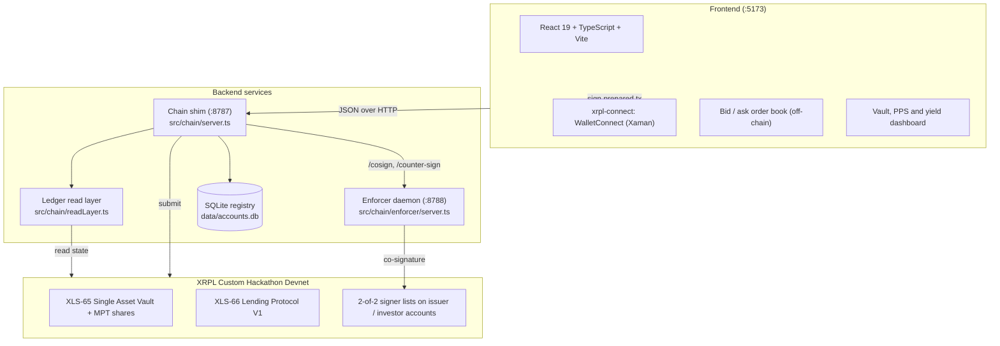

# AT1 Bond Issuance & Marketplace on XRPL (XLS-65 / XLS-66)

> **XRPL Lending Protocol Hackathon 2026** · Track 1 (open-ended Single Asset Vault + Lending Protocol V1)
> **Team** BSA Degen · **Flavour** Loaded: XLS-65/66 + native XRPL 2-of-2 multisig used as a call-date enforcer
> **Network** Custom Hackathon Devnet (`rippled 3.4.0-rc1`) · **Library** `xrpl.js 5.2.0` (stable)

An Additional Tier 1 (AT1) bond platform built on the XRP Ledger's native vault (**XLS-65**) and lending (**XLS-66**) primitives. One bond = one vault. Investors earn a continuously accruing yield they can harvest at any time, while their principal stays locked until the bond's call date.

**Contents**
1. [What it is](#1-what-it-is)
2. [How a bond lives on the ledger](#2-how-a-bond-lives-on-the-ledger)
3. [The call-date lock and the enforcer](#3-the-call-date-lock-and-the-enforcer)
4. [Accounts and custody](#4-accounts-and-custody)
5. [Architecture](#5-architecture)
6. [On-chain proof: 16 verified transactions](#6-on-chain-proof-16-verified-transactions)
7. [Run it](#7-run-it)
8. [Using the app](#8-using-the-app)
9. [Tests and verification](#9-tests-and-verification)
10. [Scripts reference](#10-scripts-reference)
11. [Environment and network](#11-environment-and-network)
12. [Known limitations](#12-known-limitations)
13. [Deliverables and documentation index](#13-deliverables-and-documentation-index)

---

## 1. What it is

In traditional finance an **AT1 bond** is subordinated debt that pays a high periodic coupon, absorbs losses first when the issuer gets into trouble, and has a **call date** at which the issuer redeems the principal. Investors cannot get their principal back before that date.

This platform maps each of those properties onto a native XRPL primitive:

| AT1 property | On XRPL |
|---|---|
| One bond issuance | One open-ended Single Asset Vault (`VaultCreate`), created when the issuer posts a bid |
| Investor subscription | `VaultDeposit`: XRP in, MPT vault shares out at the current price per share |
| Coupon | `LoanPay` by the issuer: raises the vault's assets, so the **price per share (PPS = AssetsTotal / SharesTotal)** rises for every holder |
| Harvesting the coupon | A partial `VaultWithdraw` sized to the accrued yield, leaving the principal shares untouched |
| Principal locked until the call date | Two layers: the vault is illiquid while the principal is out on loan (native `tecINSUFFICIENT_FUNDS`), and an early payoff by the issuer needs a co-signature the platform's **enforcer** only gives at or after the call date (§3) |
| Loss absorption | Broker first-loss capital (`LoanBrokerCoverDeposit`) and write-down via `LoanManage tfLoanImpair` |
| Bid/ask discovery | An off-chain order book in the frontend; nothing is written on-ledger until a deposit happens |

The frontend is a marketplace: issuers post **bids** (amount, yield, call date), investors post indicative **asks**, and a match becomes a real deposit.

---

## 2. How a bond lives on the ledger

The full lifecycle, in the order the code runs it:

1. **Issuer posts a bid** → the platform (as Loan Broker) submits `VaultCreate`, `LoanBrokerSet` and `LoanBrokerCoverDeposit` (first-loss buffer).
2. **Investor deposits** → `VaultDeposit`, signed by the investor's own wallet. Shares are minted at the current PPS.
3. **Origination, automatic** → the deposit that brings the vault's liquid assets up to the bid's principal triggers `LoanSet` at once, signed by the broker and counter-signed by the issuer's 2-of-2 signer set. Principal moves to the issuer in this same transaction (there is no separate `LoanDraw` in XLS-66). The vault is bound to its issuer: the bid stored in the vault's `Data` field names the borrower, and both the shim and the enforcer refuse a `LoanSet` whose `Counterparty` is anyone else. If the issuer has not activated 2/2 yet, the deposit stands and origination waits (a manual *Originate* button remains as fallback).
4. **Coupons** → `LoanPay` on each due date, co-signed by the enforcer. PPS rises.
5. **Yield harvest** → partial `VaultWithdraw` of the yield-equivalent shares only, at any time.
6. **Call date** → the issuer settles the remaining scheduled coupons (`LoanPay`, late ones flagged `tfLoanLatePayment`); the last one closes the loan and the vault becomes fully liquid.
7. **Redemption** → full `VaultWithdraw`: principal plus every accrued increment of yield.

Transactions used, and what each does here:

| Transaction | Spec | Used for |
|---|---|---|
| `VaultCreate` | XLS-65 | One open-ended vault per bond, capped at the bid amount |
| `VaultDeposit` | XLS-65 | Investor funding; mints MPT shares at the current PPS |
| `VaultWithdraw` | XLS-65 | Yield-only partial redemption at any time; full redemption after the loan closes |
| `LoanBrokerSet` | XLS-66 | Broker terms: rate bounds, fees, cover requirements |
| `LoanBrokerCoverDeposit` | XLS-66 | Broker posts first-loss capital |
| `LoanSet` | XLS-66 | Origination and atomic disbursement, broker + issuer counter-signature |
| `LoanPay` | XLS-66 | Coupons, late coupons (`tfLoanLatePayment`), early close (`tfLoanFullPayment`, enforcer-gated) |
| `LoanManage` | XLS-66 | Write-down (`tfLoanImpair`) and restoration (`tfLoanUnimpair`) by the broker |
| `SignerListSet` | core | 2-of-2 signer list on issuer/investor accounts: operator key + platform enforcer |
| `AccountSet` | core | `asfDisableMaster` on those accounts, so only the signer list can act |

---

## 3. The call-date lock and the enforcer

**The problem.** An open-ended vault lets depositors withdraw whenever there is liquidity, and nothing in XLS-66 stops an issuer from repaying early. Repaying early would refill the vault and let investors pull principal before the call date. Multisig alone does not help: an XRPL signer list says *who* signs, never *when*.

**The mechanism.** The issuer's account is converted to a 2-of-2 multisig (`SignerListSet`) with its master key disabled (`AccountSet asfDisableMaster`). One signer is the issuer's operator key; the other is the platform **enforcer**, an autonomous daemon (`src/chain/enforcer/`, port 8788) whose only job is to apply a fixed policy before adding its signature:

- **`LoanPay` (issuer)** — the loan must be brokered by this platform. `tfLoanFullPayment` (an early close) is refused while the validated ledger close time is before the call date (`blocked:before-call-date`). A coupon must be exactly `PeriodicPayment + LoanServiceFee`, or, once overdue, carry `tfLoanLatePayment` with at least that plus the late fee (`wrong-amount` otherwise).
- **`VaultWithdraw` (investor with multisig active)** — redeeming up to the account's accrued yield shares is co-signed at any time; anything beyond that (principal) is co-signed only once the vault's loan is closed (`unauthorized-principal-withdrawal`). This is the investor-side half of the lock.
- Anything else is refused (`not-loan-pay` / `not-supported`). A refusal returns `{ blocked, reason }` and nothing reaches the ledger.

Routes: `POST /cosign` (the policy above), `POST /counter-sign` (the enforcer's `LoanSet` counterparty signature at origination; refused unless the `LoanBroker` is the platform's and the `Counterparty` is the issuer recorded in the vault's `Data`, `not-issuer` otherwise), `GET /health`.

**Why zero human access matters.** The enforcer's key (`ENFORCER_SEED` in `.enforcer.env`, mode `0600`) is read only by the daemon. It is never printed, never sent to the frontend, and there is no route that signs on request. If any person could co-sign on demand, the call date would be a promise, not a rule. In production the daemon belongs in a confidential enclave (AWS Nitro, HSM or TEE) so that even `root` on the host cannot extract the key or force a signature.

**What the ledger proves and what it does not.** Both bypasses are rejected by the ledger itself, not by application code: a transaction signed with the disabled master key fails `tefMASTER_DISABLED`, and a `LoanPay` carrying only the operator's signature fails `tefBAD_QUORUM` (§6, rows 5 and 10). What remains off-chain is the *timing* rule, which lives in the daemon's policy. That gap is the headline of our [feedback report](FEEDBACK_REPORT.md): we propose a native `SignAfter` condition on `SignerEntry`, or a `TokenEscrow` (XLS-85, enabled on this devnet) with `FinishAfter = callDate` composed with the repayment.

---

## 4. Accounts and custody

**The broker is the only account the backend owns.** The backend *is* the Loan Broker. `.env` holds exactly two keys, both generated by `npm run fund:setup` and never committed:

```env
BROKER_SEED=s████████████████████████████
BROKERENFORCER_SEED=s████████████████████████████
```

The broker creates vaults, sets broker terms, posts first-loss cover, originates loans and triggers write-downs. Its seed signs those directly.

**Issuers and investors bring their own wallets.** They fund a Devnet account (`npm run create-accounts N` prints funded addresses and seeds to import into a WalletConnect-compatible wallet such as Xaman) and connect through `xrpl-connect`'s **WalletConnect** adapter (QR code / deep link). That is the only connection method, for investors, issuers and the platform broker alike. The backend only ever learns the public address. Every transaction that needs their signature follows **prepare → sign → submit**: the backend autofills the JSON, the wallet signs it, the backend relays the blob. See [`docs/chain-api.md`](docs/chain-api.md) for the routes.

**Onboarding.** The first time an address connects, a modal asks one question: is this account an **Issuer (borrower)** or an **Investor (lender)**? Nothing else. The profile (reopened from the navbar pill) only adds the institution name. The 2-of-2 multisig governance is activated where it is needed: on the Issue tab for an issuer (**Activer 2/2**, before originating), in the withdraw modal for an investor. When an owner does activate multisig, their own wallet signs the `SignerListSet` + `AccountSet` pair, so the backend can never flip an account to multisig without consent. The `broker` role is reserved for the platform's own address and opens an admin panel.

**Why the operator key is backend-held (a documented SDK gap).** No wallet adapter available for this hackathon (`xrpl-connect 0.8.2`: GemWallet, Crossmark, Xaman over WalletConnect) can produce a multisig-shaped `Signers` signature, nor the `CounterpartySignature` that `LoanSet` requires from the issuer. Both need a raw private key through `xrpl.js`'s `Wallet`. So each multisig account gets a dedicated operator key pair generated and held by the backend; the *decision* to convert stays with the owner. Details and the proposed fix: [`docs/borrower-lender-custody.md`](docs/borrower-lender-custody.md).

**Why the issuer account and its operator key are distinct.** XRPL forbids an account from appearing in its own signer list (`temBAD_SIGNER`), and once the master key is disabled the account cannot sign for itself (`tefMASTER_DISABLED`). Hence three parties: the issuer's treasury account (holds the debt), its operator key (signer #1), the platform enforcer (signer #2, checks the call date).

**Local participant registry** (`data/accounts.db`, SQLite via `better-sqlite3`, `src/db/index.ts`):

| Column | Meaning |
|---|---|
| `address` | Classic XRPL address, primary key |
| `role` | `borrower`, `lender` or `broker` (`CHECK` constraint) |
| `name`, `firstName`, `userRole`, `company` | Onboarding identity |
| `seed` | Devnet test seed, only for accounts generated by the local scripts; wallet-connected accounts never hand one over |
| `operatorAddress`, `operatorSeed` | The dedicated operator key for multisig co-signing |
| `multisigActive` | `1` once `SignerListSet` + `asfDisableMaster` are confirmed on-chain |
| `createdAt` | ISO timestamp |

**Loss absorption.** If a coupon is missed (`now > NextPaymentDueDate`), the broker submits `LoanManage tfLoanImpair`: the vault's `lossUnrealized` rises and PPS drops, funded first by the broker's cover. `tfLoanUnimpair` restores it. The devnet refuses impairment on a current loan (`tecTOO_SOON`). API: `POST /tx/impair` with `{ "args": ["<LOAN_ID>"] }`.

---

## 5. Architecture



| Service | Where | What it does |
|---|---|---|
| **Frontend** | `frontend/`, port 5173 | Wallet connection and onboarding, bid/ask tranche order book, per-vault pages, live PPS, yield-only or full withdrawal, transaction toasts with explorer links. The platform broker address opens an admin panel. |
| **Chain shim** | `src/chain/server.ts`, port 8787 | JSON-over-HTTP API: `read.*`, `tx.*`, `profile.*`, `book.*`. Loads only `BROKER_SEED`. User transactions are prepared here, signed in the wallet, submitted here. |
| **Enforcer** | `src/chain/enforcer/server.ts`, port 8788 | Holds the enforcer key; applies the §3 policy against the validated ledger close time before co-signing. |
| **Registry** | `data/accounts.db`, `src/db/index.ts` | Participants, onboarding profiles, operator key pairs. |

---

## 6. On-chain proof: 16 verified transactions

One bond (200 XRP, 100 % annual, 3 coupons to a 3-minute call date), run top to bottom against the Custom Hackathon Devnet by `npm run e2e`. Every step matched its expected result. Rows marked 🛡️ are deliberate rejections, proving the guardrails hold on-ledger. Full report: [`docs/e2e-full-report.md`](docs/e2e-full-report.md).

| # | Step | Result | Explorer |
|---|---|---|---|
| 1 | `VaultCreate` | ✅ `tesSUCCESS` | [`C8B24C23A2…`](https://custom.xrpl.org/lending-hackathon.dev.ripplex.io:51233/transactions/C8B24C23A2D0499ACE61281E97DCCBC288BFC7711DCBA721CB9DBC60E591A9CC) |
| 2 | `LoanBrokerSet` | ✅ `tesSUCCESS` | [`C093128A26…`](https://custom.xrpl.org/lending-hackathon.dev.ripplex.io:51233/transactions/C093128A266EE66091CFF3EEEBCB170175221DCDC6C095DDA656E85AE8960C6B) |
| 3 | `LoanBrokerCoverDeposit` (first-loss buffer) | ✅ `tesSUCCESS` | [`CCEA07B7C4…`](https://custom.xrpl.org/lending-hackathon.dev.ripplex.io:51233/transactions/CCEA07B7C4387ECD4666476E8C22952F73ABE2F0F49952F832EFA363452CE429) |
| 4 | `VaultDeposit`, investor-signed, 200 XRP | ✅ `tesSUCCESS` | [`BA2C86E975…`](https://custom.xrpl.org/lending-hackathon.dev.ripplex.io:51233/transactions/BA2C86E975C6B07349215D05FA39E58BEE9BEDAB7261F7A31DC79E438F3E9177) |
| 5 | `Payment` signed by the disabled master key | 🛡️ `tefMASTER_DISABLED` | rejected before validation |
| 6 | `LoanSet`, broker + 2-of-2 counterparty signature | ✅ `tesSUCCESS` | [`23AA66A740…`](https://custom.xrpl.org/lending-hackathon.dev.ripplex.io:51233/transactions/23AA66A74042F4C4EC5A3ABDCACA90B9CD4715D371A01031D2DD186DDDD17ED8) |
| 7 | `LoanManage tfLoanImpair` on a loan not yet due | 🛡️ `tecTOO_SOON` | [`34AE03134F…`](https://custom.xrpl.org/lending-hackathon.dev.ripplex.io:51233/transactions/34AE03134F37ACF3C3B87AB0A5941E1AE755933662E07153F7B6FEE01CE7C13C) |
| 8 | Full `VaultWithdraw` while principal is on loan | 🛡️ `tecINSUFFICIENT_FUNDS` | [`C4240633AC…`](https://custom.xrpl.org/lending-hackathon.dev.ripplex.io:51233/transactions/C4240633AC9E52509C00370466BE8838F05B53F7DA28B61BC31D4FBA4016C1AF) |
| 9 | Early close (`tfLoanFullPayment`) before the call date | 🛡️ `blocked:before-call-date` | refused by the enforcer, never submitted |
| 10 | `LoanPay` with 1 of 2 signatures | 🛡️ `tefBAD_QUORUM` | rejected before validation |
| 11 | `LoanManage tfLoanImpair` once overdue | ✅ `tesSUCCESS` | [`7978F00413…`](https://custom.xrpl.org/lending-hackathon.dev.ripplex.io:51233/transactions/7978F00413D38372CB2757B46CB31A41D336A186B2297C9B907E8AC11BBD83B5) |
| 12 | `LoanManage tfLoanUnimpair` | ✅ `tesSUCCESS` | [`8BB3ECA9B9…`](https://custom.xrpl.org/lending-hackathon.dev.ripplex.io:51233/transactions/8BB3ECA9B954F13AFE386ECD03954E91397016236203D6EC4E83654D9C13E4A1) |
| 13 | `LoanPay` coupon #1, late-flagged; PPS rises | ✅ `tesSUCCESS` | [`5F2A407308…`](https://custom.xrpl.org/lending-hackathon.dev.ripplex.io:51233/transactions/5F2A4073080377786571A24CD2AD0B5DE334BB008871C477FDD998EE0B1211B6) |
| 14 | `VaultWithdraw`, yield only; principal shares intact | ✅ `tesSUCCESS` | [`0224724B4D…`](https://custom.xrpl.org/lending-hackathon.dev.ripplex.io:51233/transactions/0224724B4DA69A92D01D1EDA54FD13DB1D7D79520407E706C039F195E760D234) |
| 15 | Settlement at the call date: remaining coupons (`tfLoanLatePayment`), last one closes the loan | ✅ `tesSUCCESS` | [`EA805215F3…`](https://custom.xrpl.org/lending-hackathon.dev.ripplex.io:51233/transactions/EA805215F309CCC1F22A209B3B01328E351BE9EB1F73B5F90447E816D947994E) |
| 16 | Full `VaultWithdraw`: principal + all accrued yield | ✅ `tesSUCCESS` | [`99A7BB682D…`](https://custom.xrpl.org/lending-hackathon.dev.ripplex.io:51233/transactions/99A7BB682D4A772B4A2F8FF461E556DE8D8EC4A33BBED51E5EA56BF76024A7BF) |

Rows 8 and 9 together are the call-date lock in action: the ledger refuses the investor's principal while it is on loan, and the enforcer refuses to let the issuer make it liquid early.

---

## 7. Run it

**Prerequisites:** Node.js 20 or 22, npm 10+, `tmux` (for the one-command launcher), git.

### One command

```bash
npm install && (cd frontend && npm install)
npm run dev:tmux
```

`scripts/start-all.sh` then, in order: funds the platform broker and enforcer from the faucet and writes `.env` / `.enforcer.env` (plus 3 spare test accounts in `created_accounts.json` / `.txt`); runs the backend and frontend test suites; typechecks and builds; frees ports 8788, 8787, 5173; and opens a 2x2 `tmux` session named `at1`:

| Pane | Runs |
|---|---|
| 0 top-left | `npm run enforcer` (:8788) |
| 1 top-right | `ENFORCER_URL=http://localhost:8788 npm run serve` (:8787) |
| 2 bottom-left | frontend dev server (:5173) |
| 3 bottom-right | `scripts/show-accounts.ts`, live view of keys and balances |

```bash
tmux attach -t at1          # view; Ctrl+b then arrows / z (zoom) / d (detach); mouse is enabled
npm run stop:tmux           # stop everything
SKIP_FUND=1 npm run dev:tmux   # restart with the existing accounts, no faucet call
```

### Step by step

```bash
git clone git@github.com:G4SP4RDDB/AT1_XRPL.git && cd AT1_XRPL
npm install && (cd frontend && npm install)
cp .env.example .env && cp frontend/.env.example frontend/.env

npm run fund:setup          # broker + enforcer from the faucet -> .env / .enforcer.env, 3 spare accounts
npm run create-accounts 4   # optional: more funded test accounts to import into a wallet
npm run balances            # optional: check on-chain balances

npm test && (cd frontend && npm test && npm run typecheck && npm run build)

# three terminals
npm run enforcer                                   # 1: enforcer daemon, curl localhost:8788/health
ENFORCER_URL=http://localhost:8788 npm run serve   # 2: chain shim, prints the broker address
cd frontend && npm run dev                         # 3: http://localhost:5173
```

Multisig is not set up by any script: each issuer or investor activates it from the onboarding modal, signing with their own wallet.

> Caveat: this ledger is a custom network (NetworkID 4001) while WalletConnect's `xrpl:2` chain id denotes the public XRPL devnet, so a wallet that autofills and submits against its own nodes may refuse to sign for it (`request() chainId`). WalletConnect is nonetheless the single entry point, by product decision; see §12.

---

## 8. Using the app

1. **Connect** — *Connect Wallet* (top right) → scan the WalletConnect QR code (Xaman or any WalletConnect wallet). This is the only connection method, the platform broker included. First connection asks only whether you are an Issuer or an Investor; the profile later adds your institution name.
   Everyone can browse every screen; only the platform broker gets the *Broker Hub*. Actions are role-gated: only issuers can post a bond, only investors can bid on or fund a tranche (`frontend/src/lib/roles.ts`).
2. **Issue (issuer)** — first click **Activer 2/2** on the Issue tab (your wallet signs `SignerListSet` + `AccountSet`; needed once, so the enforcer can co-sign your repayments), then post a bid with amount, annual yield and call date. The platform creates the vault and broker objects on the spot.
3. **Invest (investor)** — post an indicative ask, or *Deposit* against an open bid. Your wallet signs the `VaultDeposit`; you receive MPT shares.
4. **Coupons and harvest** — the issuer pays coupons (`LoanPay`); PPS rises. Investors open *Withdraw*, choose **Yield-Only Partial** and confirm *Redeem Accrued Yield*: only the yield-equivalent shares are burned. The **Full Principal (Guardrail Test)** mode shows the on-ledger rejection while capital is on loan.
5. **Call date** — before it, an early payoff is refused by the enforcer and principal withdrawals fail on-ledger. At or after it, the issuer settles the remaining coupons; the loan closes, the vault is liquid, investors redeem principal plus yield.

---

## 9. Tests and verification

Four independent layers, all green. Summary with per-layer results: [`docs/test-verification-summary.md`](docs/test-verification-summary.md).

| Layer | Command | Covers |
|---|---|---|
| Backend unit tests (29) | `npm test` | Enforcer policy (full payment refused before the call date, exact coupon amounts, late payments), loan maths (rate scaling, call date derivation), yield share splitting, engine-code extraction, bid terms |
| Frontend unit tests (19) | `cd frontend && npm test` | Wallet context, xrpl config/client, app shell |
| On-chain end-to-end (16 steps) | `npm run e2e` | The full lifecycle of §6 against the live devnet, ~4–5 minutes (two real waits: a coupon going overdue and the call date). Rewrites `docs/e2e-full-report.md` with fresh hashes. |
| Frontend integration (17) | `cd frontend && npm run test:integration[:close]` | The same lifecycle through the browser's HTTP client against the running shim; `:close` includes settlement |

```text
✔ refuses anything that is not a LoanPay
✔ full payment is refused before the call date and allowed after
✔ on-time coupon must be exactly PeriodicPayment + LoanServiceFee
✔ callDateRipple does not drift as coupons are paid
✔ splitShares: a coupon raises PPS and a positive yield share count appears without any share burn
ℹ pass 29 | fail 0
```

---

## 10. Scripts reference

| Command | What it does |
|---|---|
| `npm run dev:tmux` / `npm run stop:tmux` | One-command launcher (§7) and its teardown |
| `npm run fund:setup` | Funds broker + enforcer from the faucet, writes `.env` / `.enforcer.env`, regenerates 3 spare test accounts (SQLite stays empty until accounts onboard) |
| `npm run create-accounts [N]` | Funds `N` fresh devnet accounts (1,000 XRP each) and prints addresses + seeds |
| `npm run enforcer` | Enforcer daemon on :8788 |
| `npm run serve` | Chain shim on :8787 (`RESET_DATA_ON_START=1` is set by the script; `ENFORCER_URL` selects the daemon, otherwise the policy runs in-process for development) |
| `npm test` | Backend unit tests |
| `npm run e2e` | 16-step on-chain lifecycle, writes `docs/e2e-full-report.md` |
| `npm run check` | Devnet reachability and required amendments (`SingleAssetVault`, `LendingProtocol`, `fixCleanup3_4_0`, …) |
| `npm run balances` / `npm run all-balances` | On-chain balances of configured accounts / full liquid-vs-reserved report |
| `npm run vaults` / `npm run objects` | Scan vaults (PPS, loans, call dates) / raw ledger objects |
| `npm run show:accounts` | Formatted view of platform keys, registered accounts, balances |
| `npm run spike` / `npm run demo` | The original lifecycle spike and demo flow (historical, see `docs/spike-results.md`) |
| `npm run fund` | **Legacy**: funds one account per role and writes `BORROWER_SEED`, `LENDER1_SEED`, … into `.env`, which `loadAccounts()` still honours as overrides for scripts. Prefer `fund:setup`. |
| `cd frontend && npm run dev / build / typecheck / test / test:integration` | Frontend dev server, production bundle, `tsc -b`, Vitest unit and integration suites |

---

## 11. Environment and network

| Parameter | Value |
|---|---|
| Track | 1, open-ended Single Asset Vault, Lending Protocol V1 |
| Network | Custom Hackathon Devnet, `rippled 3.4.0-rc1`, amendments `SingleAssetVault`, `LendingProtocol`, `LendingProtocolV1_1`, `fixCleanup3_4_0`, `TokenEscrow`, `PermissionedDomains`, `Credentials`, `MPTokensV1` |
| Reserves | 10 XRP base + 2 XRP per object |
| WSS / RPC | `wss://lending-hackathon.dev.ripplex.io:51233` / `https://lending-hackathon.dev.ripplex.io:51234` |
| Explorer | https://custom.xrpl.org/lending-hackathon.dev.ripplex.io:51233/ |
| Faucet | https://lending-hackathon-faucet.dev.ripplex.io/accounts (1,000 XRP, port 443) |
| Library | `xrpl.js 5.2.0` (stable), `xrpl-connect 0.8.2` |

Environment files (all gitignored): `.env` (`BROKER_SEED`, `BROKERENFORCER_SEED`, optional `XRPL_WSS` / `XRPL_RPC` / `XRPL_FAUCET` / `XRPL_EXPLORER` overrides), `.enforcer.env` (`BROKER_ADDRESS`, `ENFORCER_SEED`), `frontend/.env` (`VITE_XRPL_*` endpoints, `VITE_CHAIN_URL`). Templates: `.env.example`, `frontend/.env.example`.

> Some venue networks drop TLS on ports 51233/51234 while 443 works. The browser only talks to the shim, so the UI works anywhere; the machine running the shim needs a network that reaches the ledger ports. See `docs/friction-log.md` #4.

---

## 12. Known limitations

- **No native time condition on multisig.** The call-date rule is enforced by the daemon's policy, not by the ledger (§3). Proposed fixes in the feedback report: `SignAfter` on `SignerEntry`, or a `TokenEscrow` composition.
- **Operator keys are backend-held** because no wallet adapter can produce multisig or `LoanSet` counterparty signatures (§4).
- **WalletConnect on a custom network.** WalletConnect identifies XRPL networks by CAIP id (`xrpl:0/1/2`); this devnet is NetworkID 4001, so a wallet that autofills and submits on its own nodes may refuse to sign. A per-network CAIP id (or a way to pass the node URL in the pairing) is the fix we would propose.
- **The order book is off-chain.** Bids and asks are frontend state; nothing is on-ledger until a deposit.
- **No native "this vault lends only to X".** Neither `VaultCreate` nor `LoanBrokerSet` can restrict the loan counterparty; we record the issuer in the vault's `Data` and enforce it in the shim and the enforcer. A `LoanBrokerSet.AllowedCounterparty` (or a Credential requirement on borrowers) would make it a ledger rule.
- **Write-down, not conversion.** XLS-66 supports impairment, not converting debt to equity.
- **No oracle-driven trigger.** A CET1-style trigger would need an off-chain oracle; impairment is triggered manually by the broker.
- **No per-investor minimum ticket** is enforced natively; Credentials / Permissioned Domains would be the way to gate that.

---

## 13. Deliverables and documentation index

**Hackathon deliverables**

| Deliverable | Where |
|---|---|
| Developer feedback report (max 3 pages, 40 % of the score) | [`FEEDBACK_REPORT.md`](FEEDBACK_REPORT.md) |
| Slide deck (10 slides, 4-minute demo + 2-minute Q&A) | [`slides/BSA_DEGEN_AT1_XRPL_PITCH.md`](slides/BSA_DEGEN_AT1_XRPL_PITCH.md) |
| Verified on-chain transactions | §6 above, [`docs/e2e-full-report.md`](docs/e2e-full-report.md) |
| Raw friction log (26 entries: category, repro, severity, library version, proposed fix) | [`docs/friction-log.md`](docs/friction-log.md) |
| Full analysis compendium (architecture evolution, Track 1 vs 2, custody decisions, every friction with repro) | [`docs/comprehensive-analysis-and-feedback.md`](docs/comprehensive-analysis-and-feedback.md) |
| DevEx hook | `xrpl-devex-hook/` installed and active on every developer machine |

**Technical documentation**

| File | What's in it |
|---|---|
| [`docs/chain-api.md`](docs/chain-api.md) | The chain shim's HTTP contract: every `read.*` / `tx.*` / `profile.*` / `book.*` function, shapes, result codes, the enforcer policy |
| [`docs/borrower-lender-custody.md`](docs/borrower-lender-custody.md) | Why issuers/investors are independent wallets, and the two wallet-tooling gaps that keep one co-signing key backend-held |
| [`docs/bank-profiles-and-order-book.md`](docs/bank-profiles-and-order-book.md) | The tranche order book (Morpho / Hyperliquid / Tenor-inspired UI) and the off-chain bank-profile store. The bank-profile *form* has since been removed: display names now come from the institution entered at onboarding, the store only pre-seeds the three demo banks |
| [`docs/tech-stack.md`](docs/tech-stack.md) | Stack rationale, zero-custody boundaries, security model |
| [`docs/frontend-integration.md`](docs/frontend-integration.md) | Call sequence per screen, with real devnet response samples |
| [`frontend/README.md`](frontend/README.md) | Frontend layout, scripts, tests |

**Verification reports**

| File | What's in it |
|---|---|
| [`docs/test-verification-summary.md`](docs/test-verification-summary.md) | Four-layer verification summary for a full pipeline run |
| [`docs/e2e-full-report.md`](docs/e2e-full-report.md) | The 16-step on-chain run, every hash |
| [`docs/spike-results.md`](docs/spike-results.md) | Raw output of the first lifecycle spikes, including the early-close measurement |

**Planning and event material** (historical / reference, not deliverables)

| File | What's in it |
|---|---|
| [`docs/dev-pipeline.md`](docs/dev-pipeline.md), [`docs/plan-foundations.md`](docs/plan-foundations.md) | The original build plan and its first subplan |
| [`two_person_split.md`](two_person_split.md) | The layer-based split that kept two people off the same files |
| [`xrpl_lending_slides.md`](xrpl_lending_slides.md), [`slides/XRPL Lending Protocol Hackathon Challenge.md`](<slides/XRPL Lending Protocol Hackathon Challenge.md>), [`slides/XRPL Workshop - Lending Protocol Hackathon.md`](<slides/XRPL Workshop - Lending Protocol Hackathon.md>), [`slides/final lending intro.md`](<slides/final lending intro.md>) | Organizer decks, transcribed |

**Repository layout**

```text
src/chain/        ledger execution: ops.ts (transaction builders), readLayer.ts (PPS / yield maths),
                  accounts.ts, server.ts (:8787), enforcer/ (policy + daemon :8788)
src/db/           SQLite participant registry
shared/           types.ts and chainClient.ts, the contract between frontend and chain layer
frontend/         Vite + React 19 app; integration/ holds the live-devnet suite
scripts/          setup, diagnostics, e2e and demo runners
tests/            backend unit tests
docs/, slides/    documentation and the pitch deck
```
