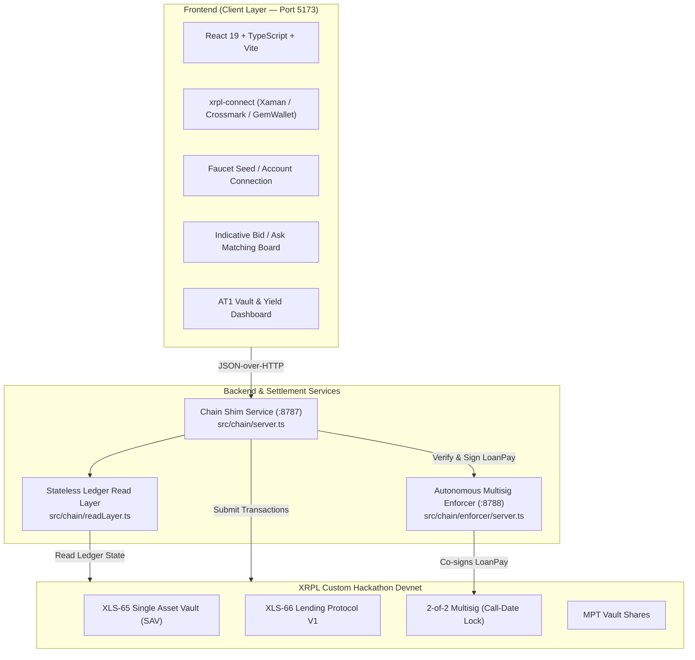

# AT1 Bond Issuance & Marketplace on XRPL (XLS-65 / XLS-66)

> **XRPL Lending Protocol Hackathon 2026** — Track 1 (Open-ended Vault + Lending Protocol V1)  
> **Team**: BSA Degen | **Flavour**: Loaded (XLS-65 / XLS-66 + XRPL Native Multisig + MPT)

An on-chain Additional Tier 1 (AT1) bond issuance and investment platform built natively on the XRP Ledger using **XLS-65 (Single Asset Vault)** and **XLS-66 (Lending Protocol V1)**.

---

## 1. Executive Summary

In traditional finance, **Additional Tier 1 (AT1)** contingent convertible bonds are perpetual subordinated debt instruments designed to absorb losses while paying high, periodic coupon yields. They feature a fixed **Call Date** at which the issuer can redeem the principal, but investors cannot withdraw their principal before that date.

This platform implements AT1 bonds natively on XRPL:
- **1 Bond = 1 Open-Ended Vault (`VaultCreate`)**: Automatically spawned when a corporate borrower publishes a debt bid.
- **Indicative Matching Layer**: An off-chain frontend order-matching board allowing lenders to discover bids and align terms before committing capital.
- **Continuous Yield Accrual & On-Demand Withdrawal**: Borrower coupon payments (`LoanPay`) increase the vault's **Price Per Share (PPS = AssetsTotal / SharesTotal)**. Depositors can withdraw their accrued yield anytime via a partial `VaultWithdraw`, without touching their locked principal.
- **Call-Date Lock via Multisig**: The principal remains illiquid while out on loan. Early loan payoff is strictly blocked by an on-chain **2-of-2 Multisig gate** (`SignerListSet` + `asfDisableMaster`), with an autonomous **Enforcer Daemon** that only signs the final loan clearance transaction at or after the agreed Call Date.

---

## 2. Track & Environment Configuration

| Parameter | Specification |
|---|---|
| **Hackathon Track** | **Track 1: Open-ended Single Asset Vault** |
| **Protocol Standards** | **XLS-65** (Single Asset Vault) & **XLS-66** (Lending Protocol V1) |
| **Flavour** | **Loaded** (Core XLS-65/66 + Native 2-of-2 Multisig Enforcer + MPT) |
| **Network** | **Custom Hackathon Devnet** (`rippled 3.4.0-rc1` with `fixCleanup3_4_0`) |
| **Client Library** | `xrpl.js` (Stable `^5.2.0`) |
| **WebSocket (WSS)** | `wss://lending-hackathon.dev.ripplex.io:51233` |
| **JSON-RPC** | `https://lending-hackathon.dev.ripplex.io:51234` |
| **Explorer** | [https://custom.xrpl.org/lending-hackathon.dev.ripplex.io:51233/](https://custom.xrpl.org/lending-hackathon.dev.ripplex.io:51233/) |
| **Faucet** | [https://lending-hackathon-faucet.dev.ripplex.io/accounts](https://lending-hackathon-faucet.dev.ripplex.io/accounts) |

---

## 3. Platform Broker Identity

The platform operates an institutional loan broker configured on the Custom Hackathon Devnet:

```text
🛡️ PLATFORM BROKER ADDRESS: r4araZQfT6Wn4jr2QkiGevUzb6ABFvnBg4
```

- **Startup Banner**: Displayed automatically when running `npm run serve`.
- **Frontend Header**: Displayed in the navigation bar with a 1-click address copy button.
- **API Endpoint**: Queryable via `POST /read/brokerAddress`.

---

## 4. XLS-65 & XLS-66 Transactions Used

| Transaction | Protocol | Role / Description |
|---|---|---|
| `VaultCreate` | **XLS-65** | Creates an open-ended Single Asset Vault for each bond issuance upon borrower bid creation. |
| `LoanBrokerSet` | **XLS-66** | Configures loan broker parameters, interest rate bounds, platform fees, and first-loss capital buffer (`CoverAvailable`). |
| `VaultDeposit` | **XLS-65** | Investors deposit XRP into the bond vault, minting MPT vault shares proportional to the current Price Per Share. |
| `LoanSet` | **XLS-66** | Originates the loan terms (principal, coupon rate, interval, Call Date maturity) with mutual broker and borrower approval. |
| `LoanDraw` | **XLS-66** | Borrower draws down the borrowed principal from the vault. |
| `LoanPay` | **XLS-66** | Periodic coupon repayments by the borrower to increase vault assets and PPS; final payoff is multisig-gated. |
| `VaultWithdraw` | **XLS-65** | Partial share redemption to withdraw accrued yield, or full redemption after Call Date loan clearance. |
| `SignerListSet` | **Core XRPL** | Establishes the 2-of-2 multisig rule on the borrower account (`BorrowerOp` + `Platform Enforcer`) with master key disabled (`asfDisableMaster`). |

---

## 5. Architecture Overview



### Services Breakdown

1. **Frontend (`frontend/`, Port 5173)**:
   - Clean institutional UI with real-time on-chain data.
   - Direct wallet integration: Connect via **Xaman / Crossmark / GemWallet** or input a **Devnet Faucet Seed / Address**.
   - Dynamic yield calculation showing accrued profit and yield-equivalent share redemption.
2. **Chain Shim (`src/chain/server.ts`, Port 8787)**:
   - JSON-over-HTTP API exposing typed `read` and `tx` operations without exposing node signing primitives to the browser.
   - Dynamic session wallet registry (`tx.registerWallet`) to support custom imported seeds on-the-fly.
3. **Multisig Enforcer Daemon (`src/chain/enforcer/server.ts`, Port 8788)**:
   - Autonomous microservice holding the enforcer key.
   - Inspects `LoanPay` transactions against ledger close time and loan maturity.
   - Approves periodic coupons, but strictly blocks early principal payoff before the Call Date.

---

## 6. Installation & Setup Guide

### Prerequisites
- **Node.js**: `v20.x` or `v22.x`
- **npm**: `v10.x` or higher
- Git with SSH key configured

### Step 1: Clone and Install Dependencies

```bash
# Clone the repository
git clone git@github.com:G4SP4RDDB/AT1_XRPL.git
cd AT1_XRPL

# Install root dependencies
npm install

# Install frontend dependencies
cd frontend && npm install && cd ..
```

### Step 2: Configure Environment Variables

```bash
# Copy example environment files
cp .env.example .env
cp frontend/.env.example frontend/.env
```

To automatically fund development roles (Broker, Borrower, Lenders) on the Custom Hackathon Devnet:
```bash
npm run fund
```

### Step 3: Launch the Services

Start the three services in separate terminals (or in the background):

```bash
# 1. Start the Autonomous Multisig Enforcer (Port 8788)
npm run enforcer

# 2. Start the Chain Shim API (Port 8787)
ENFORCER_URL=http://localhost:8788 npm run serve

# 3. Start the Frontend Dev Server (Port 5173)
cd frontend
npm run dev
```

Open your browser at **[http://localhost:5173](http://localhost:5173)**.

---

## 7. Connecting Your Wallet & User Flow

1. **Connect Wallet**:
   - Click **Connect Wallet** in the top-right corner.
   - Choose **XRPL Wallet** for Xaman / Crossmark, or select **Faucet Seed / Address** and paste an active Devnet account seed.
2. **Borrower Flow (Issuance)**:
   - Submit a **Debt Bid** specifying the principal amount, offered annual yield, and Call Date.
   - The platform automatically deploys an on-chain **Single Asset Vault** (`VaultCreate`) and configures the **Loan Broker** (`LoanBrokerSet`).
3. **Lender Flow (Investment)**:
   - Submit an indicative **Ask** to signal liquidity demand.
   - Click **Deposit** on a matched bid: your funds are deposited into the vault (`VaultDeposit`) and you receive MPT vault shares.
4. **Coupon Distribution & Yield Harvest**:
   - The borrower pays periodic interest coupons via `LoanPay`.
   - Each payment increases the vault's total assets and share price (PPS).
   - Lenders can click **Claim Accrued Yield** (`VaultWithdraw`), burning only the yield-equivalent shares while leaving their principal locked in the vault.
5. **Call Date & Principal Redemption**:
   - Prior to Call Date: Attempting to fully redeem principal triggers the protocol's native **"insufficient liquidity" guardrail** (capital is out on loan). Early full loan repayment is blocked by the Enforcer.
   - On/After Call Date: The borrower initiates final loan repayment; the Enforcer approves and co-signs the transaction. Once repaid, capital becomes liquid in the vault and lenders can withdraw their full principal.

---

## 8. Verification & Test Suite

### Backend Unit Tests (24 Passing Tests)

Verifies interest scaling, enforcer policy, early repayment refusal, share splitting, and error code extraction:

```bash
npm test
```

```text
✔ refuses anything that is not a LoanPay
✔ refuses loans brokered by someone else, or unknown loans
✔ on-time coupon must be exactly PeriodicPayment + LoanServiceFee
✔ full payment is refused before the call date and allowed after
✔ callDateRipple does not drift as coupons are paid
✔ periodicRate scales an annual 1/10 bp rate to one interval
✔ splitShares: a coupon raises PPS and positive yield shares appear
...
ℹ pass 24 | fail 0
```

### Frontend Typechecking, Tests & Build

```bash
cd frontend
npm run typecheck       # Strict TypeScript check (tsc -b)
npm test                # Vitest unit test suite
npm run build           # Production bundle via Vite / Rolldown
```

---

## 9. Key Developer Feedback & Findings

As part of the hackathon evaluation criteria (40% Developer Feedback Quality), detailed friction reports and proposed protocol enhancements are documented in:
- [`docs/friction-log.md`](docs/friction-log.md): Real-world friction points encountered with XLS-65/66.
- [`docs/tech-stack.md`](docs/tech-stack.md): Architectural design rationale and boundary separation.

### Headline Finding: The Multisig Timing Gap
While XLS-65 prevents premature principal redemption via native liquidity guardrails while capital is out on loan, XRPL currently lacks an on-chain time-locked repayment primitive to stop a borrower from clearing a loan prematurely. We resolved this through a **2-of-2 multisig schedule enforcer**, and propose hardening it via **TokenEscrow (`FinishAfter`)** as a native XLS-85 composition.

---

## 10. Repository Structure

```text
├── docs/                       # Architectural specs, friction logs, and reports
│   ├── chain-api.md            # Chain shim API documentation
│   ├── friction-log.md         # Detailed hackathon friction log & proposals
│   └── tech-stack.md           # Technology stack deep-dive
├── frontend/                   # Vite + React 19 web application
│   ├── src/                    # Components, pages, wallet context, chainClient
│   └── integration/            # Frontend integration test suite
├── shared/                     # Frozen contracts & types between layers
│   ├── types.ts                # Domain models (Bid, Ask, VaultState, LoanState)
│   └── chainClient.ts          # Typed HTTP client bridge
├── src/chain/                  # Ledger execution & enforcer engine
│   ├── accounts.ts             # Devnet account loading & role derivation
│   ├── enforcer/               # Multisig Call-Date policy enforcer daemon
│   ├── ops.ts                  # On-chain transaction builders & executors
│   ├── readLayer.ts            # Stateless ledger decoder & PPS / yield calculators
│   └── server.ts               # Chain shim HTTP service (:8787)
└── tests/                      # Backend unit test suite (24 tests)
```
