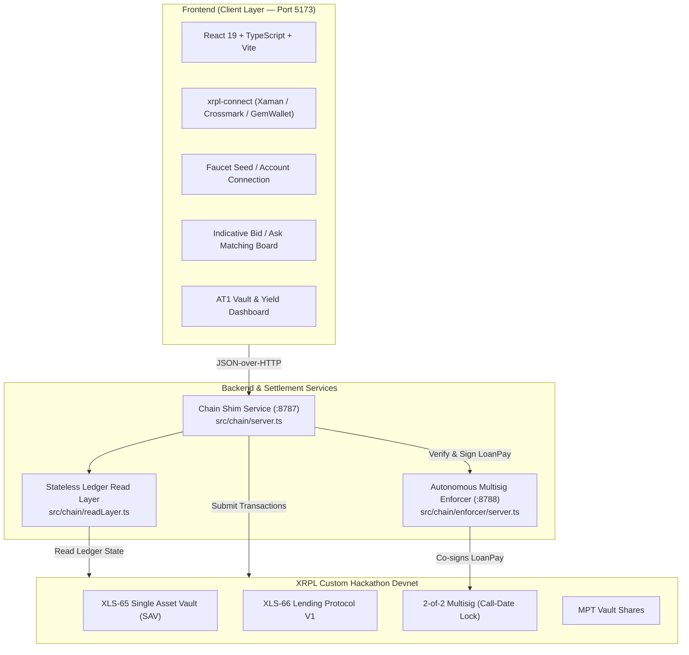

# AT1 Bond Issuance & Marketplace on XRPL (XLS-65 / XLS-66)

> **XRPL Lending Protocol Hackathon 2026** — Track 1 (Open-ended Vault + Lending Protocol V1)  
> **Team**: BSA Degen | **Flavour**: Loaded (XLS-65 / XLS-66 + XRPL Native Multisig + MPT)

An on-chain Additional Tier 1 (AT1) bond issuance and investment platform built natively on the XRP Ledger using **XLS-65 (Single Asset Vault)** and **XLS-66 (Lending Protocol V1)**.

---

## 1. Executive Summary

In traditional finance, **Additional Tier 1 (AT1)** contingent convertible bonds are perpetual subordinated debt instruments designed to absorb losses while paying high, periodic coupon yields. They feature a fixed **Call Date** at which the issuer can redeem the principal, but investors cannot withdraw their principal before that date.

This platform implements AT1 bonds natively on XRPL:
- **1 Bond = 1 Open-Ended Vault (`VaultCreate`)**: Automatically spawned when a corporate borrower publishes a debt bid.
- **Indicative Matching Layer**: An off-chain frontend order-matching board allowing lenders to discover bids and align terms before committing capital.
- **Continuous Yield Accrual & On-Demand Withdrawal**: Borrower coupon payments (`LoanPay`) increase the vault's **Price Per Share (PPS = AssetsTotal / SharesTotal)**. Depositors can withdraw their accrued yield anytime via a partial `VaultWithdraw`, without touching their locked principal.
- **Call-Date Lock via Multisig**: The principal remains illiquid while out on loan. Early loan payoff is strictly blocked by an on-chain **2-of-2 Multisig gate** (`SignerListSet` + `asfDisableMaster`), with an autonomous **Enforcer Daemon** that only signs the final loan clearance transaction at or after the agreed Call Date.

---

## 2. Track & Environment Configuration

| Parameter | Specification |
|---|---|
| **Hackathon Track** | **Track 1: Open-ended Single Asset Vault** |
| **Protocol Standards** | **XLS-65** (Single Asset Vault) & **XLS-66** (Lending Protocol V1) |
| **Flavour** | **Loaded** (Core XLS-65/66 + Native 2-of-2 Multisig Enforcer + MPT) |
| **Network** | **Custom Hackathon Devnet** (`rippled 3.4.0-rc1` with `fixCleanup3_4_0`) |
| **Client Library** | `xrpl.js` (Stable `^5.2.0`) |
| **WebSocket (WSS)** | `wss://lending-hackathon.dev.ripplex.io:51233` |
| **JSON-RPC** | `https://lending-hackathon.dev.ripplex.io:51234` |
| **Explorer** | [https://custom.xrpl.org/lending-hackathon.dev.ripplex.io:51233/](https://custom.xrpl.org/lending-hackathon.dev.ripplex.io:51233/) |
| **Faucet** | [https://lending-hackathon-faucet.dev.ripplex.io/accounts](https://lending-hackathon-faucet.dev.ripplex.io/accounts) |

---

## 3. Platform Broker & Multisig Enforcer Architecture

The platform cleanly separates **business ownership** from **cryptographic enforcement** following the principle of least privilege:

```text
🛡️ PLATFORM BROKER ADDRESS : r4araZQfT6Wn4jr2QkiGevUzb6ABFvnBg4
🔐 ENFORCER SIGNER ADDRESS : rfqfTK9uH2ai5KsDLzqvU95KnUW12eh8Nn
```

### Broker vs. Signer: Understanding the Separation

| Component | Account Address | Key Location | Protocol & System Role |
|---|---|---|---|
| **Platform Broker** | `r4araZQfT6Wn4jr2QkiGevUzb6ABFvnBg4` | `BROKER_SEED` in `.env` | **Business & Vault Owner**: Creates the open-ended Vault (`VaultCreate`), manages broker fees (`LoanBrokerSet`), holds the first-loss risk buffer (`CoverAvailable`), and has sole authority to trigger loan write-downs / liquidations (`tfLoanImpair`). |
| **Enforcer Signer** | `rfqfTK9uH2ai5KsDLzqvU95KnUW12eh8Nn` | `ENFORCER_SEED` in `.enforcer.env` | **Autonomous Multisig Guardian**: Holds the 2nd seat on the corporate borrower's 2-of-2 multisig (`SignerListSet`). Verifies ledger time against the bond's Call Date before co-signing repayment transactions. |

### How Loan Liquidation & Write-Downs Work
Under XLS-66, if a borrower is delinquent on coupon payments (`now > NextPaymentDueDate`), the broker can absorb the loss using first-loss capital:
- **Transaction**: `LoanManage` with flag `tfLoanImpair` (`0x00020000`).
- **Authorization**: Signed exclusively by the **Broker** (`BROKER_SEED=sEdVBUaPMamhH5uTWHz3mPYj1ZsPqWa` in `.env`).
- **Trigger via API**: `POST http://localhost:8787/tx/impair` with `{ "args": ["<LOAN_ID_HEX>"] }`.

---

## 4. XLS-65 & XLS-66 Transactions Used

| Transaction | Protocol | Role / Description |
|---|---|---|
| `VaultCreate` | **XLS-65** | Creates an open-ended Single Asset Vault for each bond issuance upon borrower bid creation. |
| `LoanBrokerSet` | **XLS-66** | Configures loan broker parameters, interest rate bounds, platform fees, and first-loss capital buffer (`CoverAvailable`). |
| `VaultDeposit` | **XLS-65** | Investors deposit XRP into the bond vault, minting MPT vault shares proportional to the current Price Per Share. |
| `LoanSet` | **XLS-66** | Originates the loan terms (principal, coupon rate, interval, Call Date maturity) with mutual broker and borrower approval. |
| `LoanDraw` | **XLS-66** | Borrower draws down the borrowed principal from the vault. |
| `LoanPay` | **XLS-66** | Periodic coupon repayments by the borrower to increase vault assets and PPS; final payoff is multisig-gated. |
| `VaultWithdraw` | **XLS-65** | Partial share redemption to withdraw accrued yield, or full redemption after Call Date loan clearance. |
| `SignerListSet` | **Core XRPL** | Establishes the 2-of-2 multisig rule on the borrower account (`BorrowerOp` + `Platform Enforcer`) with master key disabled (`asfDisableMaster`). |

---

## 5. Architecture Overview



### Services Breakdown

1. **Frontend (`frontend/`, Port 5173)**:
   - Clean institutional UI with real-time on-chain data.
   - Direct wallet integration: Connect via **Xaman / Crossmark / GemWallet** or input a **Devnet Faucet Seed / Address**.
   - Dynamic yield calculation showing accrued profit and yield-equivalent share redemption.
2. **Chain Shim (`src/chain/server.ts`, Port 8787)**:
   - JSON-over-HTTP API exposing typed `read` and `tx` operations without exposing node signing primitives to the browser.
   - Dynamic session wallet registry (`tx.registerWallet`) to support custom imported seeds on-the-fly.
3. **Multisig Enforcer Daemon (`src/chain/enforcer/server.ts`, Port 8788)**:
   - Autonomous microservice holding the enforcer key.
   - Inspects `LoanPay` transactions against ledger close time and loan maturity.
   - Approves periodic coupons, but strictly blocks early principal payoff before the Call Date.

---

## 6. Installation & Setup Guide

### Prerequisites
- **Node.js**: `v20.x` or `v22.x`
- **npm**: `v10.x` or higher
- **tmux**: Installed (`sudo apt install tmux` on Ubuntu/Debian)
- Git with SSH key configured

---

### Method 1: The Automated Pipeline (Recommended) 🚀

This single command executes the complete end-to-end launch pipeline in **5 automated steps**:

```bash
npm run dev:tmux
```

#### What happens under the hood:
1. **⚡ Account Generation & Funding** (`scripts/fund-and-setup.ts`):
   - Requests 8 fresh accounts from the Custom Devnet faucet (1,000 XRP each).
   - Writes the new private seeds to `.env` (`BROKER_SEED`, `LENDER1_SEED`, `BORROWER_SEED`, etc.).
   - Writes `.enforcer.env` with the new Broker address and Enforcer seed.
   - Waits for ledger validation and deploys the **2-of-2 Multisig rule** (`SignerListSet`) on the borrower with the master key disabled (`asfDisableMaster`).
2. **🧪 Test Suite**: Runs all 24 backend tests and 19 frontend Vitest tests.
3. **⚙️ Compilation & Typecheck**: Compiles TypeScript (`tsc --noEmit`) and creates a production bundle (`vite build`).
4. **🧹 Port Cleanup**: Automatically frees ports 8788, 8787, and 5173.
5. **🖥️ Split-Screen tmux (Grille 2x2 — 4 Volets)**: Launches a detached session (`at1`) with 4 synchronized panes:
   - **Volet 0 (Haut-Gauche)** : `🛡️ 1. Multisig Enforcer` (`:8788`)
   - **Volet 1 (Haut-Droit)** : `🔗 2. Chain Shim API` (`:8787`)
   - **Volet 2 (Bas-Gauche)** : `💻 3. Frontend Dev Server` (`:5173`)
   - **Volet 3 (Bas-Droit)** : `💎 4. Account Seeds & Credentials` (Affichage en direct des comptes créés, adresses, clés privées et soldes).

#### Managing the tmux session:
```bash
# Attach and view the 4-pane dashboard:
tmux attach -t at1

# Useful shortcuts inside tmux:
# - Click on any pane with your mouse (mouse support is enabled)
# - Ctrl+b then arrow keys : navigate between panes
# - Ctrl+b then z          : toggle fullscreen zoom on the active pane
# - Ctrl+b then d          : detach from tmux (services remain running)

# Stop all 3 services and kill the session cleanly:
npm run stop:tmux
```

> **Tip**: If you want to restart the services with your **existing accounts** without re-funding from the faucet, simply run:
> ```bash
> SKIP_FUND=1 npm run dev:tmux
> ```

---

### Method 2: Step-by-Step Manual Setup (Terminal by Terminal) 🛠️

For developers who prefer manual control over each individual service:

#### Step 1: Clone and Install Dependencies
```bash
# Clone the repository
git clone git@github.com:G4SP4RDDB/AT1_XRPL.git
cd AT1_XRPL

# Install root & backend dependencies
npm install

# Install frontend dependencies
cd frontend && npm install && cd ..
```

#### Step 2: Configure Environment Files
```bash
cp .env.example .env
cp frontend/.env.example frontend/.env
```

#### Step 3: Fund Accounts & Configure On-Chain Multisig
Generate fresh roles from the Devnet faucet, populate `.env` / `.enforcer.env`, and submit the multisig configuration:
```bash
npm run fund:setup
```

*(Optional: To create additional throwaway funded test accounts at any time:)*
```bash
npm run create-accounts 4
```

To verify on-chain balances across all configured accounts:
```bash
npm run balances
```

#### Step 4: Run Tests & Compile Codebase
```bash
# Run backend test suite (24 tests)
npm test

# Run frontend tests & strict typecheck
cd frontend
npm test
npm run typecheck
npm run build
cd ..
```

#### Step 5: Start the 3 Services in Separate Terminals

- **Terminal 1 — Autonomous Multisig Enforcer (Port 8788)**:
  ```bash
  npm run enforcer
  ```
  *(Healthcheck: `curl http://localhost:8788/health`)*

- **Terminal 2 — Chain Shim Service (Port 8787)**:
  ```bash
  ENFORCER_URL=http://localhost:8788 npm run serve
  ```
  *(Prints the Platform Broker Address banner on startup)*

- **Terminal 3 — Frontend Web Application (Port 5173)**:
  ```bash
  cd frontend
  npm run dev
  ```

#### Step 6: Access the Application
Open your browser at **[http://localhost:5173](http://localhost:5173)**.

---

## 7. Connecting Your Wallet & User Flow

1. **Connect Wallet**:
   - Click **Connect Wallet** in the top-right corner.
   - Connect via your XRPL wallet (Xaman / Crossmark / GemWallet) using the native `xrpl-connect` WalletConnect URI or QR code.
2. **Borrower Flow (Issuance)**:
   - Submit a **Debt Bid** specifying the principal amount, offered annual yield, and Call Date.
   - The platform automatically deploys an on-chain **Single Asset Vault** (`VaultCreate`) and configures the **Loan Broker** (`LoanBrokerSet`).
3. **Lender Flow (Investment)**:
   - Submit an indicative **Ask** to signal liquidity demand.
   - Click **Deposit** on a matched bid: your funds are deposited into the vault (`VaultDeposit`) and you receive MPT vault shares.
4. **Coupon Distribution & Yield Harvest**:
   - The borrower pays periodic interest coupons via `LoanPay`.
   - Each payment increases the vault's total assets and share price (PPS).
   - Lenders can click **Claim Accrued Yield** (`VaultWithdraw`), burning only the yield-equivalent shares while leaving their principal locked in the vault.
5. **Call Date & Principal Redemption**:
   - Prior to Call Date: Attempting to fully redeem principal triggers the protocol's native **"insufficient liquidity" guardrail** (capital is out on loan). Early full loan repayment is blocked by the Enforcer.
   - On/After Call Date: The borrower initiates final loan repayment; the Enforcer approves and co-signs the transaction. Once repaid, capital becomes liquid in the vault and lenders can withdraw their full principal.

---

## 8. Verification & Test Suite

### Backend Unit Tests (24 Passing Tests)

Verifies interest scaling, enforcer policy, early repayment refusal, share splitting, and error code extraction:

```bash
npm test
```

```text
✔ refuses anything that is not a LoanPay
✔ refuses loans brokered by someone else, or unknown loans
✔ on-time coupon must be exactly PeriodicPayment + LoanServiceFee
✔ full payment is refused before the call date and allowed after
✔ callDateRipple does not drift as coupons are paid
✔ periodicRate scales an annual 1/10 bp rate to one interval
✔ splitShares: a coupon raises PPS and positive yield shares appear
...
ℹ pass 24 | fail 0
```

### Frontend Typechecking, Tests & Build

```bash
cd frontend
npm run typecheck       # Strict TypeScript check (tsc -b)
npm test                # Vitest unit test suite
npm run build           # Production bundle via Vite / Rolldown
```

---

## 9. Key Developer Feedback & Findings

As part of the hackathon evaluation criteria (40% Developer Feedback Quality), detailed friction reports and proposed protocol enhancements are documented in:
- [`docs/friction-log.md`](docs/friction-log.md): Real-world friction points encountered with XLS-65/66.
- [`docs/tech-stack.md`](docs/tech-stack.md): Architectural design rationale and boundary separation.

### Headline Finding: The Multisig Timing Gap
While XLS-65 prevents premature principal redemption via native liquidity guardrails while capital is out on loan, XRPL currently lacks an on-chain time-locked repayment primitive to stop a borrower from clearing a loan prematurely. We resolved this through a **2-of-2 multisig schedule enforcer**, and propose hardening it via **TokenEscrow (`FinishAfter`)** as a native XLS-85 composition.

---

## 10. Available Scripts & Cheatsheet

| Command | Description |
|---|---|
| `npm run dev:tmux` | **All-in-One Launcher**: Runs all tests, compiles TS/Vite, clears ports, and launches Enforcer (`:8788`), Shim (`:8787`), and Frontend (`:5173`) in a 3-pane tmux session. |
| `npm run stop:tmux` | Gracefully stops the `at1` tmux session and frees ports 8788, 8787, and 5173. |
| `npm test` | Runs the 24 backend unit tests (math, policy, enforcer, share split). |
| `npm run check` | Validates Devnet WSS connectivity and checks required protocol amendments (`SingleAssetVault`, `LendingProtocol`, `fixCleanup3_4_0`, etc.). |
| `npm run balances` | Queries on-chain XRP balances and sequence numbers for all configured roles. |
| `npm run all-balances` | Full diagnostic report of liquid and reserved XRP balances across all accounts. |
| `npm run vaults` | Scans on-chain vaults, Price Per Share (PPS), outstanding loans, and call dates. |
| `npm run create-accounts [N]` | Generates and funds `N` fresh Devnet accounts (1,000 XRP each) and outputs their addresses & seeds. |
| `npm run fund` | Automatically funds and populates root `.env` demo seeds from the Devnet faucet. |
| `npm run fund:setup` | Generates fresh accounts, updates `.env` & `.enforcer.env`, and configures borrower multisig on-chain. |
| `npm run show:accounts` | Displays a formatted summary of all active roles, addresses, seeds, and verified XRP balances. |
| `npm run enforcer` | Starts the standalone Multisig Call-Date Enforcer daemon on port `8788`. |
| `npm run serve` | Starts the Chain Shim JSON-over-HTTP API bridge on port `8787`. |
| `cd frontend && npm test` | Runs the Vitest frontend unit test suite (19 tests). |
| `cd frontend && npm run typecheck` | Strict TypeScript check (`tsc -b`) for the frontend. |
| `cd frontend && npm run build` | Compiles the production bundle via Vite & Rolldown. |

---

## 11. Repository Structure

```text
├── docs/                       # Architectural specs, friction logs, and reports
│   ├── chain-api.md            # Chain shim API documentation
│   ├── friction-log.md         # Detailed hackathon friction log & proposals
│   └── tech-stack.md           # Technology stack deep-dive
├── frontend/                   # Vite + React 19 web application
│   ├── src/                    # Components, pages, wallet context, chainClient
│   └── integration/            # Frontend integration test suite
├── shared/                     # Frozen contracts & types between layers
│   ├── types.ts                # Domain models (Bid, Ask, VaultState, LoanState)
│   └── chainClient.ts          # Typed HTTP client bridge
├── src/chain/                  # Ledger execution & enforcer engine
│   ├── accounts.ts             # Devnet account loading & role derivation
│   ├── enforcer/               # Multisig Call-Date policy enforcer daemon
│   ├── ops.ts                  # On-chain transaction builders & executors
│   ├── readLayer.ts            # Stateless ledger decoder & PPS / yield calculators
│   └── server.ts               # Chain shim HTTP service (:8787)
└── tests/                      # Backend unit test suite (24 tests)
```
