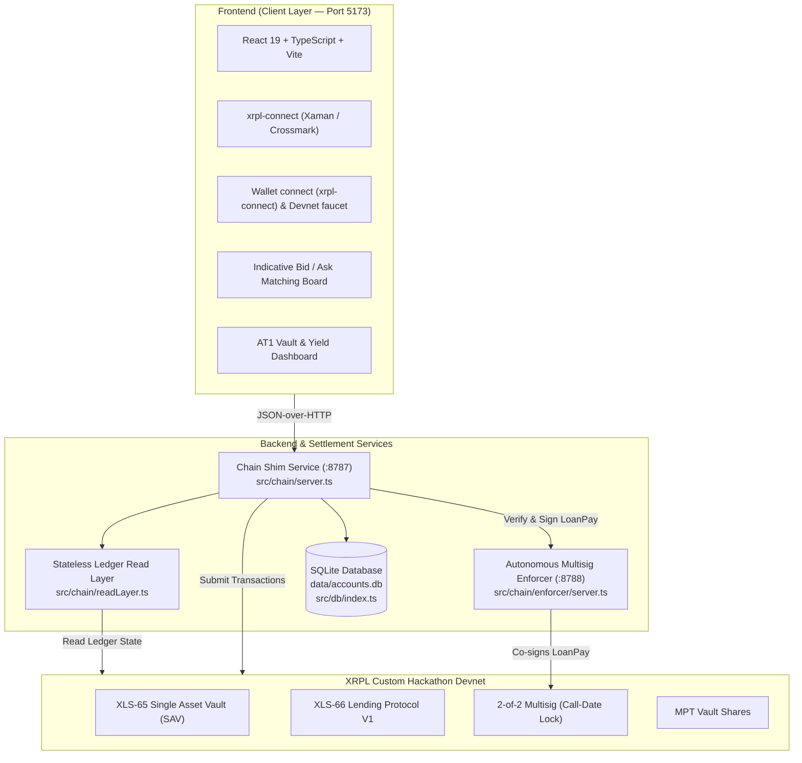

# AT1 Bond Issuance & Marketplace on XRPL (XLS-65 / XLS-66)

> **XRPL Lending Protocol Hackathon 2026** — Track 1 (Open-ended Vault + Lending Protocol V1)  
> **Team**: BSA Degen | **Flavour**: Loaded (XLS-65 / XLS-66 + native XRPL 2-of-2 multisig as a call-date enforcer)

An on-chain Additional Tier 1 (AT1) bond issuance and investment platform built natively on the XRP Ledger using **XLS-65 (Single Asset Vault)** and **XLS-66 (Lending Protocol V1)**.

---

## 1. Executive Summary

In traditional finance, **Additional Tier 1 (AT1)** contingent convertible bonds are perpetual subordinated debt instruments designed to absorb losses while paying high, periodic coupon yields. They feature a fixed **Call Date** at which the issuer can redeem the principal, but investors cannot withdraw their principal before that date.

This platform implements AT1 bonds natively on XRPL:
- **1 Bond = 1 Open-Ended Vault (`VaultCreate`)**: Automatically spawned when a corporate borrower publishes a debt bid.
- **Indicative Matching Layer**: An off-chain frontend order-matching board allowing lenders to discover bids and align terms before committing capital.
- **Continuous Yield Accrual & On-Demand Withdrawal**: Borrower coupon payments (`LoanPay`) increase the vault's **Price Per Share (PPS = AssetsTotal / SharesTotal)**. Depositors can withdraw their accrued yield anytime via a partial `VaultWithdraw`, without touching their locked principal.
- **Call-Date Lock via Multisig**: The principal remains illiquid while out on loan. Early loan payoff is strictly blocked by an on-chain **2-of-2 Multisig gate** (`SignerListSet` + `asfDisableMaster`), with an autonomous **Enforcer Daemon** that only signs the final loan clearance transaction at or after the agreed Call Date.

---

## 2. Track & Environment Configuration

| Parameter | Specification |
|---|---|
| **Hackathon Track** | **Track 1: Open-ended Single Asset Vault** |
| **Protocol Standards** | **XLS-65** (Single Asset Vault) & **XLS-66** (Lending Protocol V1) |
| **Flavour** | **Loaded** (Core XLS-65/66 + native 2-of-2 multisig call-date enforcer; MPT vault shares are intrinsic to XLS-65, not counted as the extra primitive) |
| **Network** | **Custom Hackathon Devnet** (`rippled 3.4.0-rc1` with `fixCleanup3_4_0`) |
| **Client Library** | `xrpl.js` (Stable `^5.2.0`) |
| **WebSocket (WSS)** | `wss://lending-hackathon.dev.ripplex.io:51233` |
| **JSON-RPC** | `https://lending-hackathon.dev.ripplex.io:51234` |
| **Explorer** | [https://custom.xrpl.org/lending-hackathon.dev.ripplex.io:51233/](https://custom.xrpl.org/lending-hackathon.dev.ripplex.io:51233/) |
| **Faucet** | [https://lending-hackathon-faucet.dev.ripplex.io/accounts](https://lending-hackathon-faucet.dev.ripplex.io/accounts) |

---

## 3. Account Architecture & Custody Model

### 3.1 The Broker: the only account the backend owns
In this design **the backend *is* the Loan Broker**. It must never know in advance, or hard-code, the private keys of borrowers or investors.

- **`.env`** contains **strictly and only** the platform's own identities — the Broker and its multisig Enforcer:
  ```env
  BROKER_SEED=s████████████████████████████  # generated by `npm run fund:setup`, never committed
  BROKERENFORCER_SEED=s████████████████████████████
  ```
- **Broker responsibilities**: creates the issuance vault (`VaultCreate`), structures the loan terms (`LoanBrokerSet`), posts first-loss capital (`LoanBrokerCoverDeposit`), and absorbs losses on default (`LoanManage tfLoanImpair`).

### 3.2 Lenders and borrowers: independent wallets
Lenders and borrowers are **not** minted or custodied by the backend. They fund their own Devnet accounts (`npm run create-accounts N` prints funded addresses + seeds to import into Xaman, GemWallet or Crossmark) and connect through `xrpl-connect` (`frontend/src/lib/xrplConnect.ts`). The backend only ever learns the connected **public address**.

The first time a new address connects, a mandatory onboarding modal (`BorrowerOnboardingModal`) asks it to choose **Borrower** or **Lender** (there is no "unassigned" state), fill in a display identity (first name, job title, company), and optionally activate 2-of-2 multisig governance. The `broker` role is reserved for the platform's own address and opens an admin panel instead.

Every user-signed transaction follows **prepare → sign → submit**: the backend autofills the transaction JSON (never signs it), the connected wallet signs it, and the backend relays the signed blob to the ledger. Routes are documented in [`docs/chain-api.md`](docs/chain-api.md).

### 3.3 Local participant registry (`data/accounts.db`)
A local **SQLite** database (`src/db/index.ts`, `better-sqlite3`) keeps the directory of participants:

| Column | Type | Description |
|---|---|---|
| `address` | `TEXT PRIMARY KEY` | Classic XRPL address (`r...`) of the participant. |
| `role` | `TEXT` | `'borrower'`, `'lender'` or `'broker'` (enforced by a `CHECK` constraint). |
| `name` | `TEXT` | Display name. |
| `seed` | `TEXT` | Devnet test seed — only populated for accounts generated by the local scripts; wallet-connected accounts never hand one over. |
| `firstName` / `userRole` / `company` | `TEXT` | Onboarding identity (e.g. *CFO*, *AT1 Corporate Issuer SA*). |
| `operatorAddress` / `operatorSeed` | `TEXT` | The dedicated operator key (`borrowerOp`) allocated to this account for multisig co-signing (see 3.4). |
| `multisigActive` | `INTEGER` | `1` once `SignerListSet` + `asfDisableMaster` are confirmed on-chain. |
| `createdAt` | `TEXT` | ISO timestamp. |

### 3.4 Why the borrower account and its operator key (`borrowerOp`) are distinct
*Why can't the borrower just sign with its own key?*

1. **Protocol rule (`SignerListSet`)**: an account may not appear in its own signer list — $\text{SignerEntry.Account} \neq \text{Account}$. Trying returns `temBAD_SIGNER`.
2. **Master key disabled (`asfDisableMaster: 4`)**: to guarantee investors that the borrower cannot repay early by surprise, the borrower's master key is disabled; any master-signed transaction is rejected with `tefMASTER_DISABLED`.
3. **Separation of powers**:
   - **`borrower`** — the corporate treasury account (holds the debt, receives the principal).
   - **`borrowerOp`** — signer #1 (the issuer's operational key).
   - **`brokerEnforcer`** — signer #2 (the platform's fiduciary key, checks the Call Date).

   Each borrower gets **its own dedicated operator key pair**, never shared between borrowers.

> **Known custody gap (documented as SDK feedback)**: no wallet adapter available for this hackathon (`xrpl-connect 0.8.2` — GemWallet, Crossmark, Xaman/WalletConnect) can produce a multisig-shaped `Signers` signature, nor the `CounterpartySignature` that `LoanSet` requires from the borrower. Both need a raw private key via `xrpl.js`'s `Wallet`. Consequently the operator key is generated and held by the backend, while the *decision* to convert an account to multisig (the `SignerListSet` + `AccountSet` pair) is signed by the owner's own wallet. Details: [`docs/borrower-lender-custody.md`](docs/borrower-lender-custody.md).

### 3.5 Zero-human Enforcer (signature #2 of the multisig)
An AT1 bond's maturity lock must not depend on human discretion:
- **Software-only key**: the enforcer's seed (`ENFORCER_SEED` in `.enforcer.env`, mode `0600`) is held and used **exclusively by the autonomous daemon** (`src/chain/enforcer/server.ts`, port 8788).
- **No human access**: no operator (borrower, broker or admin) can request a manual signature or extract the key. It is never printed, never exposed to the frontend, and there is no arbitrary-signing endpoint.
- **Three routes, no discretionary signing** (`src/chain/enforcer/server.ts`): `GET /health`, `POST /counter-sign` (adds the enforcer's `LoanSet` counterparty signature at origination, the broker's own act, no policy check) and `POST /cosign`, which applies a fixed policy and returns either a signature or `{ blocked, reason }`:
  - **`LoanPay` (borrower)**: the loan must be brokered by this platform; `tfLoanFullPayment` (an early close) is refused while the validated ledger close time is before the call date (`blocked:before-call-date`); a coupon must be exactly `PeriodicPayment + LoanServiceFee`, or carry `tfLoanLatePayment` with at least that plus the late fee once overdue (`wrong-amount` otherwise).
  - **`VaultWithdraw` (lender with multisig active)**: redeeming up to the account's yield shares is co-signed at any time; anything beyond that (principal) is co-signed only once the vault's loan is closed (`unauthorized-principal-withdrawal` otherwise). This is the lender-side half of the call-date lock.
  - Anything else is refused (`not-loan-pay` / `not-supported`). When a request is refused the signing routine is never reached.
- **In production**: the daemon would run inside a confidential enclave (**AWS Nitro Enclaves, HSM or TEE**), making key extraction or forced signing cryptographically impossible even with `root` on the host.

### 3.6 Loss absorption (write-down)
Under XLS-66, if a borrower misses a coupon (`now > NextPaymentDueDate`), the Broker can absorb the loss against its first-loss capital:
- **Transaction**: `LoanManage` with `tfLoanImpair` (`0x00020000`); `tfLoanUnimpair` restores the loan.
- **Signer**: the **Broker** only (`BROKER_SEED`).
- **API trigger**: `POST http://localhost:8787/tx/impair` with `{ "args": ["<LOAN_ID_HEX>"] }`.

---

## 4. XLS-65 & XLS-66 Transactions Used

| Transaction | Protocol | Role / Description |
|---|---|---|
| `VaultCreate` | **XLS-65** | Creates an open-ended Single Asset Vault for each bond issuance upon borrower bid creation. |
| `LoanBrokerSet` | **XLS-66** | Configures loan broker parameters, interest rate bounds, platform fees, and first-loss capital buffer (`CoverAvailable`). |
| `LoanBrokerCoverDeposit` | **XLS-66** | Broker deposits first-loss absorption capital into the broker risk buffer. |
| `VaultDeposit` | **XLS-65** | Investors deposit XRP into the bond vault, minting MPT vault shares proportional to the current Price Per Share. |
| `LoanSet` | **XLS-66** | Originates and atomically disburses principal with mutual broker and borrower approval (Note: no separate `LoanDraw` exists in XLS-66). |
| `LoanPay` | **XLS-66** | Periodic coupon repayments by the borrower to increase vault assets and PPS; final payoff is multisig-gated. |
| `LoanManage` | **XLS-66** | Broker triggers loss absorption write-down (`tfLoanImpair`) or restores loan health (`tfLoanUnimpair`). |
| `VaultWithdraw` | **XLS-65** | Partial share redemption to withdraw accrued yield, or full redemption after Call Date loan clearance. |
| `SignerListSet` | **Core XRPL** | Establishes the 2-of-2 multisig rule on the borrower account (`BorrowerOp` + `Platform Enforcer`) with master key disabled (`asfDisableMaster`). |
| `AccountSet` | **Core XRPL** | Disables the borrower's master key (`asfDisableMaster`) to enforce multisig co-signature compliance. |

---

## 5. Verified On-Chain Transactions (Deliverable Proof)

Every phase of the AT1 bond lifecycle has been executed and verified on the **Custom Hackathon Devnet** (`lending-hackathon.dev.ripplex.io:51233`), covering happy paths, protocol guardrail rejections, multisig enforcement, and write-down / impairment:

> **Reproducibility**: Run `npm run e2e` to re-execute all 16 on-chain steps against Devnet (report generated in [`docs/e2e-full-report.md`](docs/e2e-full-report.md)).

| # | Step / Mechanism | Expected Result | Devnet Status | Verified On-Chain Explorer Link |
|---|---|---|---|---|
| **1** | `VaultCreate` (Open-ended SAV) | `tesSUCCESS` | ✅ `tesSUCCESS` | [`C8B24C23A2...`](https://custom.xrpl.org/lending-hackathon.dev.ripplex.io:51233/transactions/C8B24C23A2D0499ACE61281E97DCCBC288BFC7711DCBA721CB9DBC60E591A9CC) |
| **2** | `LoanBrokerSet` (Rates & Fees) | `tesSUCCESS` | ✅ `tesSUCCESS` | [`C093128A26...`](https://custom.xrpl.org/lending-hackathon.dev.ripplex.io:51233/transactions/C093128A266EE66091CFF3EEEBCB170175221DCDC6C095DDA656E85AE8960C6B) |
| **3** | `LoanBrokerCoverDeposit` (First-loss buffer) | `tesSUCCESS` | ✅ `tesSUCCESS` | [`CCEA07B7C4...`](https://custom.xrpl.org/lending-hackathon.dev.ripplex.io:51233/transactions/CCEA07B7C4387ECD4666476E8C22952F73ABE2F0F49952F832EFA363452CE429) |
| **4** | `VaultDeposit` (Lender capital -> MPT shares) | `tesSUCCESS` | ✅ `tesSUCCESS` | [`BA2C86E975...`](https://custom.xrpl.org/lending-hackathon.dev.ripplex.io:51233/transactions/BA2C86E975C6B07349215D05FA39E58BEE9BEDAB7261F7A31DC79E438F3E9177) |
| **5** | Master Key Disabled Check (`asfDisableMaster`) | `tefMASTER_DISABLED` | 🛡️ `tefMASTER_DISABLED` | Native Ledger Rejection (Master key disabled) |
| **6** | `LoanSet` (2-of-2 Multisig Counterparty Approval) | `tesSUCCESS` | ✅ `tesSUCCESS` | [`23AA66A740...`](https://custom.xrpl.org/lending-hackathon.dev.ripplex.io:51233/transactions/23AA66A74042F4C4EC5A3ABDCACA90B9CD4715D371A01031D2DD186DDDD17ED8) |
| **7** | Guardrail: `LoanManage tfLoanImpair` (Not yet due) | `tecTOO_SOON` | 🛡️ `tecTOO_SOON` | [`34AE03134F...`](https://custom.xrpl.org/lending-hackathon.dev.ripplex.io:51233/transactions/34AE03134F37ACF3C3B87AB0A5941E1AE755933662E07153F7B6FEE01CE7C13C) |
| **8** | Guardrail: Full `VaultWithdraw` while capital on loan | `tecINSUFFICIENT_FUNDS` | 🛡️ `tecINSUFFICIENT_FUNDS` | [`C4240633AC...`](https://custom.xrpl.org/lending-hackathon.dev.ripplex.io:51233/transactions/C4240633AC9E52509C00370466BE8838F05B53F7DA28B61BC31D4FBA4016C1AF) |
| **9** | Enforcer Policy: Early repayment refusal before Call Date | `blocked:before-call-date` | 🛡️ Blocked | Autonomous Enforcer Daemon policy gate |
| **10** | Quorum Guardrail: `LoanPay` with 1 of 2 signatures | `tefBAD_QUORUM` | 🛡️ `tefBAD_QUORUM` | Native Ledger Rejection (Multisig threshold 2 not met) |
| **11** | Loss Absorption: `LoanManage tfLoanImpair` (Overdue) | `tesSUCCESS` | ✅ `tesSUCCESS` | [`7978F00413...`](https://custom.xrpl.org/lending-hackathon.dev.ripplex.io:51233/transactions/7978F00413D38372CB2757B46CB31A41D336A186B2297C9B907E8AC11BBD83B5) |
| **12** | Debt Restoration: `LoanManage tfLoanUnimpair` | `tesSUCCESS` | ✅ `tesSUCCESS` | [`8BB3ECA9B9...`](https://custom.xrpl.org/lending-hackathon.dev.ripplex.io:51233/transactions/8BB3ECA9B954F13AFE386ECD03954E91397016236203D6EC4E83654D9C13E4A1) |
| **13** | Periodic Coupon: `LoanPay` (Increases PPS) | `tesSUCCESS` | ✅ `tesSUCCESS` | [`5F2A407308...`](https://custom.xrpl.org/lending-hackathon.dev.ripplex.io:51233/transactions/5F2A4073080377786571A24CD2AD0B5DE334BB008871C477FDD998EE0B1211B6) |
| **14** | `VaultWithdraw` (Yield-only partial harvest) | `tesSUCCESS` | ✅ `tesSUCCESS` | [`0224724B4D...`](https://custom.xrpl.org/lending-hackathon.dev.ripplex.io:51233/transactions/0224724B4DA69A92D01D1EDA54FD13DB1D7D79520407E706C039F195E760D234) |
| **15** | Settlement at Call Date (remaining coupons via `LoanPay` + `tfLoanLatePayment`; the last one closes the loan) | `tesSUCCESS` | ✅ `tesSUCCESS` | [`EA805215F3...`](https://custom.xrpl.org/lending-hackathon.dev.ripplex.io:51233/transactions/EA805215F309CCC1F22A209B3B01328E351BE9EB1F73B5F90447E816D947994E) |
| **16** | Final Full `VaultWithdraw` (Principal + Yield) | `tesSUCCESS` | ✅ `tesSUCCESS` | [`99A7BB682D...`](https://custom.xrpl.org/lending-hackathon.dev.ripplex.io:51233/transactions/99A7BB682D4A772B4A2F8FF461E556DE8D8EC4A33BBED51E5EA56BF76024A7BF) |

---

## 6. Architecture Overview



### Services Breakdown

1. **Frontend (`frontend/`, port 5173)**:
   - Institutional real-time UI with transaction toasts (hash, ledger result, explorer link).
   - Wallet connection via `xrpl-connect` (Xaman / GemWallet / Crossmark); mandatory Borrower/Lender onboarding; the platform broker address opens an admin panel.
   - Bid/ask tranche order book, per-vault pages, live Price Per Share (PPS) and yield-only partial withdrawal that leaves principal untouched.
2. **Chain Shim (`src/chain/server.ts`, port 8787)**:
   - JSON-over-HTTP API exposing the typed `read`, `tx`, `profile` and `book` groups.
   - Loads only `BROKER_SEED` from `.env`; user transactions go through prepare → sign (in the user's wallet) → submit.
3. **Multisig Enforcer daemon (`src/chain/enforcer/server.ts`, port 8788)**:
   - Standalone microservice holding the enforcer key (`.enforcer.env`).
   - Checks the validated ledger close time and refuses to co-sign any early full repayment before the agreed Call Date.
4. **Participant registry (`data/accounts.db`, `src/db/index.ts`)**:
   - Directory of borrowers and lenders, their onboarding profiles (CFO, company…) and their dedicated operator key pairs (`borrowerOp`).

---

## 7. Installation & Setup Guide

### Prerequisites
- **Node.js**: `v20.x` or `v22.x`
- **npm**: `v10.x` or higher
- **tmux**: Installed (`sudo apt install tmux` on Ubuntu/Debian)
- Git with SSH key configured

---

### Method 1: The Automated Pipeline (Recommended) 🚀

This single command executes the complete end-to-end launch pipeline in **5 automated steps**:

```bash
npm run dev:tmux
```

#### What happens under the hood:
1. **⚡ Broker Generation & DB Initialization** (`scripts/fund-and-setup.ts`):
   - Funds the Platform Broker and its Enforcer from the Devnet faucet (1,000 XRP each).
   - Writes `.env` containing **only** `BROKER_SEED` and `BROKERENFORCER_SEED` (no client keys).
   - Wipes and regenerates 3 unassigned, faucet-funded test accounts in `created_accounts.json` / `.txt` (the SQLite registry stays empty until each account connects and onboards).
2. **🧪 Test Suite**: runs the 29 backend unit tests and the 19 frontend Vitest tests (all passing).
3. **⚙️ Compilation & Typecheck**: TypeScript check (`tsc --noEmit`) and the Vite production bundle.
4. **🧹 Port Cleanup**: frees ports 8788, 8787 and 5173.
5. **🖥️ Split-screen tmux (2x2 grid, 4 panes)**: starts the `at1` session with:
   - **Pane 0 (top-left)**: `🛡️ 1. Multisig Enforcer` (`:8788`)
   - **Pane 1 (top-right)**: `🔗 2. Chain Shim API` (`:8787`)
   - **Pane 2 (bottom-left)**: `💻 3. Frontend Dev Server` (`:5173`)
   - **Pane 3 (bottom-right)**: `💎 4. Account Seeds & Credentials` (live view of the keys and the SQLite registry).

#### Managing the tmux session:
```bash
# Attach and view the 4-pane dashboard:
tmux attach -t at1

# Useful shortcuts inside tmux:
# - Click on any pane with your mouse (mouse support is enabled)
# - Ctrl+b then arrow keys : navigate between panes
# - Ctrl+b then z          : toggle fullscreen zoom on the active pane
# - Ctrl+b then d          : detach from tmux (services remain running)

# Stop all 3 services and kill the session cleanly:
npm run stop:tmux
```

> **Tip**: If you want to restart the services with your **existing accounts** without re-funding from the faucet, simply run:
> ```bash
> SKIP_FUND=1 npm run dev:tmux
> ```

---

### Method 2: Step-by-Step Manual Setup (Terminal by Terminal) 🛠️

For developers who prefer manual control over each individual service:

#### Step 1: Clone and Install Dependencies
```bash
# Clone the repository
git clone git@github.com:G4SP4RDDB/AT1_XRPL.git
cd AT1_XRPL

# Install root & backend dependencies
npm install

# Install frontend dependencies
cd frontend && npm install && cd ..
```

#### Step 2: Configure Environment Files
```bash
cp .env.example .env
cp frontend/.env.example frontend/.env
```

#### Step 3: Fund the Platform Accounts
Fund the broker and its enforcer from the Devnet faucet, write `.env` / `.enforcer.env`, and generate 3 spare test accounts. Multisig is activated later, per account, from the onboarding modal (the owner's wallet signs `SignerListSet` + `AccountSet`):
```bash
npm run fund:setup
```

*(Optional: To create additional throwaway funded test accounts at any time:)*
```bash
npm run create-accounts 4
```

To verify on-chain balances across all configured accounts:
```bash
npm run balances
```

#### Step 4: Run Tests & Compile Codebase
```bash
# Run backend test suite (29 tests)
npm test

# Run frontend tests & strict typecheck
cd frontend
npm test
npm run typecheck
npm run build
cd ..
```

#### Step 5: Start the 3 Services in Separate Terminals

- **Terminal 1 — Autonomous Multisig Enforcer (Port 8788)**:
  ```bash
  npm run enforcer
  ```
  *(Healthcheck: `curl http://localhost:8788/health`)*

- **Terminal 2 — Chain Shim Service (Port 8787)**:
  ```bash
  ENFORCER_URL=http://localhost:8788 npm run serve
  ```
  *(Prints the Platform Broker Address banner on startup)*

- **Terminal 3 — Frontend Web Application (Port 5173)**:
  ```bash
  cd frontend
  npm run dev
  ```

#### Step 6: Access the Application
Open your browser at **[http://localhost:5173](http://localhost:5173)**.

---

## 8. Connecting Your Wallet & User Flow

1. **Connect Wallet**:
   - Click **Connect Wallet** in the top-right corner.
   - Connect via your XRPL wallet (Xaman / Crossmark / GemWallet) using the native `xrpl-connect` WalletConnect URI or QR code.
2. **Borrower Flow (Issuance)**:
   - Submit a **Debt Bid** specifying the principal amount, offered annual yield, and Call Date.
   - The platform automatically deploys an on-chain **Single Asset Vault** (`VaultCreate`) and configures the **Loan Broker** (`LoanBrokerSet`).
3. **Lender Flow (Investment)**:
   - Submit an indicative **Ask** to signal liquidity demand.
   - Click **Deposit** on a matched bid: your funds are deposited into the vault (`VaultDeposit`) and you receive MPT vault shares.
4. **Coupon Distribution & Yield Harvest**:
   - The borrower pays periodic interest coupons via `LoanPay`.
   - Each payment increases the vault's total assets and share price (PPS).
   - Lenders open **Withdraw**, pick **Yield-Only Partial** and confirm **Redeem Accrued Yield** (`VaultWithdraw`), burning only the yield-equivalent shares while leaving their principal locked in the vault. The **Full Principal (Guardrail Test)** mode is there to show the on-ledger rejection while capital is on loan.
5. **Call Date & Principal Redemption**:
   - Prior to Call Date: Attempting to fully redeem principal triggers the protocol's native **"insufficient liquidity" guardrail** (capital is out on loan). Early full loan repayment is blocked by the Enforcer.
   - On/After Call Date: The borrower initiates final loan repayment; the Enforcer approves and co-signs the transaction. Once repaid, capital becomes liquid in the vault and lenders can withdraw their full principal.

---

## 9. Verification & Test Suite

### Backend Unit Tests (29 Passing Tests)

Verifies interest scaling, enforcer policy, early repayment refusal, share splitting, and error code extraction:

```bash
npm test
```

```text
✔ refuses anything that is not a LoanPay
✔ refuses loans brokered by someone else, or unknown loans
✔ on-time coupon must be exactly PeriodicPayment + LoanServiceFee
✔ full payment is refused before the call date and allowed after
✔ callDateRipple does not drift as coupons are paid
✔ periodicRate scales an annual 1/10 bp rate to one interval
✔ splitShares: a coupon raises PPS and a positive yield share count appears without any share burn
...
ℹ pass 29 | fail 0  (+ 4 read-layer / terms suites not shown)
```

### On-Chain End-to-End Devnet Verification (16/16 Steps)

Executes the complete bond lifecycle against the live Custom Hackathon Devnet, asserting ledger states, guardrails, and yield mathematics:

```bash
npm run e2e
```

Generates the audit report at [`docs/e2e-full-report.md`](docs/e2e-full-report.md) with verified transaction hashes on the custom explorer.

### Frontend Typechecking, Tests & Build

```bash
cd frontend
npm run typecheck       # Strict TypeScript check (tsc -b)
npm test                # Vitest unit test suite (19 tests)
npm run build           # Production bundle via Vite / Rolldown
```

---

## 10. Key Developer Feedback & Deliverables

As part of the hackathon evaluation criteria (**40% Developer Feedback Quality**, **10% Presentation & Slide Deck**), our core deliverables are:
- [**`FEEDBACK_REPORT.md`**](FEEDBACK_REPORT.md): **Official 3-page Developer Feedback Report** at repository root detailing friction findings, ledger result codes, and actionable architectural proposals for Ripple and the XRPL ecosystem.
- [**`docs/comprehensive-analysis-and-feedback.md`**](docs/comprehensive-analysis-and-feedback.md): **Compendium Exhaustif** de toutes les analyses techniques, évolutions architecturales (Track 1 vs 2, Zero-Custody, `borrowerOp` security), et 18 frictions protocolaires documentées depuis le début du hackathon.
- [**`slides/BSA_DEGEN_AT1_XRPL_PITCH.md`**](slides/BSA_DEGEN_AT1_XRPL_PITCH.md): **Official 10-Slide Presentation Pitch Deck** structured for the 4-minute demo + 2-minute Q&A.
- [`docs/friction-log.md`](docs/friction-log.md): Granular technical log with repros, severity tags, and exact code citations.
- [`docs/tech-stack.md`](docs/tech-stack.md): Architectural design rationale, zero-custody boundaries, and security model.
- [`docs/e2e-full-report.md`](docs/e2e-full-report.md): Verified on-chain ledger test execution report (16 transactions).

### Headline Finding: The Multisig Timing Gap
While XLS-65 prevents premature principal redemption via native liquidity guardrails while capital is out on loan, XRPL currently lacks an on-chain time-locked repayment primitive to stop a borrower from clearing a loan prematurely. We resolved this through a **2-of-2 multisig schedule enforcer** governed by an autonomous daemon with **Zero Human Access**, and propose hardening it via **`SignerCondition` (`SignAfter`)** or **TokenEscrow (`FinishAfter`)** as a native XLS-85 composition.

---

## 11. Available Scripts & Cheatsheet

| Command | Description |
|---|---|
| `npm run dev:tmux` | **All-in-One Launcher**: Generates accounts, executes full test suite, compiles TS/Vite, frees ports, and launches Enforcer (`:8788`), Shim (`:8787`), Frontend (`:5173`), and Live Credentials Viewer in a 4-pane tmux session (2x2 grid). |
| `npm run stop:tmux` | Gracefully stops the `at1` tmux session and frees ports 8788, 8787, and 5173. |
| `npm test` | Runs the 29 backend unit tests (math, policy, enforcer, share split). |
| `npm run e2e` | Runs the 16-step on-chain end-to-end bond lifecycle against Devnet (vault creation, multisig, guardrails, impairment, coupon harvest, call date repayment) and writes `docs/e2e-full-report.md`. |
| `npm run check` | Validates Devnet WSS connectivity and checks required protocol amendments (`SingleAssetVault`, `LendingProtocol`, `fixCleanup3_4_0`, etc.). |
| `npm run balances` | Queries on-chain XRP balances and sequence numbers for all configured roles. |
| `npm run all-balances` | Full diagnostic report of liquid and reserved XRP balances across all accounts. |
| `npm run vaults` | Scans on-chain vaults, Price Per Share (PPS), outstanding loans, and call dates. |
| `npm run create-accounts [N]` | Generates and funds `N` fresh Devnet accounts (1,000 XRP each) and outputs their addresses & seeds. |
| `npm run fund` | **Legacy**, pre custody change: funds one account per role and writes `BORROWER_SEED`, `LENDER1_SEED`, … into `.env`, which `loadAccounts()` still honours as overrides for scripts. Not used by the current setup; prefer `npm run fund:setup`. |
| `npm run fund:setup` | Generates fresh accounts, updates `.env` & `.enforcer.env`, and configures borrower multisig on-chain. |
| `npm run show:accounts` | Displays a formatted summary of all active roles, addresses, seeds, and verified XRP balances. |
| `npm run enforcer` | Starts the standalone Multisig Call-Date Enforcer daemon on port `8788`. |
| `npm run serve` | Starts the Chain Shim JSON-over-HTTP API bridge on port `8787`. |
| `cd frontend && npm test` | Runs the Vitest frontend unit test suite (19 tests). |
| `cd frontend && npm run typecheck` | Strict TypeScript check (`tsc -b`) for the frontend. |
| `cd frontend && npm run build` | Compiles the production bundle via Vite & Rolldown. |

---

## 12. Repository Structure

```text
├── docs/                       # Architectural specs, friction logs, and reports
│   ├── chain-api.md            # Chain shim API documentation
│   ├── e2e-full-report.md      # On-chain verified test report (16 transactions)
│   ├── friction-log.md         # Detailed hackathon friction log & proposals (15 points)
│   └── tech-stack.md           # Technology stack deep-dive
├── frontend/                   # Vite + React 19 web application
│   ├── src/                    # Components, lib (wallet context, chainClient, order book, bank profiles)
│   └── integration/            # Frontend integration test suite
├── shared/                     # Frozen contracts & types between layers
│   ├── types.ts                # Domain models (Bid, Ask, VaultState, LoanState)
│   └── chainClient.ts          # Typed HTTP client bridge
├── src/chain/                  # Ledger execution & enforcer engine
│   ├── accounts.ts             # Devnet account loading & role derivation
│   ├── enforcer/               # Multisig Call-Date policy enforcer daemon
│   ├── ops.ts                  # On-chain transaction builders & executors
│   ├── readLayer.ts            # Stateless ledger decoder & PPS / yield calculators
│   └── server.ts               # Chain shim HTTP service (:8787)
└── tests/                      # Backend unit test suite (29 tests)
```

---

## 13. Full Documentation Index

Every markdown file in the repository, so nothing is orphaned. The mandatory hackathon
deliverables are already called out in §10 above; this indexes the rest.

### Technical documentation (`docs/`)

| File | What's in it |
|---|---|
| [`docs/chain-api.md`](docs/chain-api.md) | The chain shim's full HTTP contract — every `read.*` / `tx.*` / `profile.*` / `book.*` function, its shape, and what each result code means. |
| [`docs/bank-profiles-and-order-book.md`](docs/bank-profiles-and-order-book.md) | Design and implementation notes for the off-chain bank-profile registry and the tranche order book (Morpho / Hyperliquid / Tenor-inspired UI), including deviations from the reference specs and what was verified live against the devnet. |
| [`docs/borrower-lender-custody.md`](docs/borrower-lender-custody.md) | Why lenders/borrowers are independent, externally-signed wallets rather than backend-minted accounts, and the two wallet-tooling gaps (multisig signing, `LoanSet` `CounterpartySignature`) that keep one cosigning key backend-held regardless. |
| [`docs/frontend-integration.md`](docs/frontend-integration.md) | Call sequence per screen from the frontend to the chain layer, with real devnet response samples. |
| [`docs/tech-stack.md`](docs/tech-stack.md) | Architecture rationale, zero-custody boundaries, security model. (Also linked in §10.) |
| [`docs/dev-pipeline.md`](docs/dev-pipeline.md) | The original end-to-end build plan, from empty repo to submission. |
| [`docs/plan-foundations.md`](docs/plan-foundations.md) | Subplan 1 (Foundations), cut from the dev pipeline above. |
| [`frontend/README.md`](frontend/README.md) | Frontend-specific setup notes (Vite + React + TypeScript). |

### Test & verification reports

| File | What's in it |
|---|---|
| [`docs/e2e-full-report.md`](docs/e2e-full-report.md) | The 16-step on-chain end-to-end lifecycle run. (Also linked in §10.) |
| [`docs/test-verification-summary.md`](docs/test-verification-summary.md) | Four-layer verification summary (backend unit tests, on-chain e2e, frontend tests, manual checks) for a full pipeline run. |
| [`docs/spike-results.md`](docs/spike-results.md) | Raw output from the earliest on-chain lifecycle spike. |
| [`docs/friction-log.md`](docs/friction-log.md) | Granular friction log with repros and severity tags. (Also linked in §10.) |

### Planning & process

| File | What's in it |
|---|---|
| [`two_person_split.md`](two_person_split.md) | The layer-based (not feature-based) split used to keep two people from conflicting on the same files. |

### Event source material (organizer-provided, reference only — not a team deliverable)

| File | What's in it |
|---|---|
| [`xrpl_lending_slides.md`](xrpl_lending_slides.md) | Agent-readable transcription of the organizers' slide decks. |
| [`slides/XRPL Lending Protocol Hackathon Challenge.md`](<slides/XRPL Lending Protocol Hackathon Challenge.md>) | The challenge brief, as presented. |
| [`slides/XRPL Workshop - Lending Protocol Hackathon.md`](<slides/XRPL Workshop - Lending Protocol Hackathon.md>) | The pre-event workshop slides. |
| [`slides/final lending intro.md`](<slides/final lending intro.md>) | The kickoff intro deck. |
