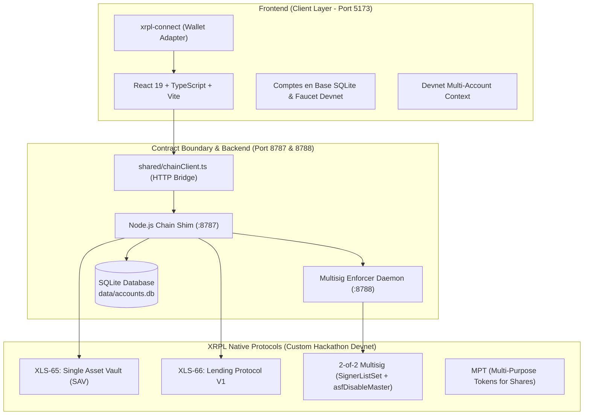

# AT1 Bond Issuance Platform — Technology Stack & Architecture

This document details the complete technology stack, architectural boundaries, and protocol standards used in the AT1 Bond Issuance Platform on the XRP Ledger.

---

## 1. High-Level Architecture

---

## 2. Blockchain & Ledger Layer (XRPL)

| Component | Standard / Technology | Usage in Platform |
|---|---|---|
| **Network** | Custom Hackathon Devnet | `rippled 3.4.0-rc1` with `fixCleanup3_4_0` amendment enabled |
| **RPC / WSS** | Rippled WebSocket & JSON-RPC | `wss://lending-hackathon.dev.ripplex.io:51233` `https://lending-hackathon.dev.ripplex.io:51234` |
| **Vault Standard** | **XLS-65** (Single Asset Vault) | Open-ended Single Asset Vaults created per bond (`VaultCreate`). Issues MPT shares for deposits (`VaultDeposit`) and burns shares on yield-only or full redemptions (`VaultWithdraw`). |
| **Lending Protocol** | **XLS-66** (Lending Protocol V1) | Risk structuring and origination: `LoanBrokerSet` (platform fees, debt caps, first-loss capital buffer `CoverAvailable`), `LoanSet` (origination co-signed by broker and borrower), `LoanPay` (periodic coupon distribution). |
| **Multisig Gate** | XRPL Native Multisig (`SignerListSet`) | 2-of-2 multisig configured on the corporate borrower account (`BorrowerOp` + `Platform Enforcer`, Quorum 2). Combined with `asfDisableMaster` to guarantee that principal cannot be repaid early without enforcer approval. |
| **Token Primitive** | **MPT** (Multi-Purpose Tokens) | Native token standard for vault share issuance (`shareMptId`). |

---

## 3. Backend & Settlement Services

* **Runtime & Tooling**: **Node.js (v22)**, TypeScript, executed with `tsx` (no compile step required for dev scripts and servers).
* **XRPL Client Library**: [`xrpl.js`](https://github.com/XRPLF/xrpl.js) for transaction preparation, multisigning, submission, and ledger querying.
* **Services**:
  1. **Chain Shim Server (`:8787`, `src/chain/server.ts`)**:
     * Minimal JSON-over-HTTP bridge exposing `POST /read/<fn>` and `POST /tx/<fn>`.
     * Isolates private signing seeds and node-only crypto libraries from the client browser.
     * Zero-Custody architecture: only requires `BROKER_SEED` in `.env`.
     * Enforces CORS for local and staging frontends.
  2. **Autonomous Enforcer Daemon (`:8788`, `src/chain/enforcer/index.ts`)**:
     * Independent signing authority holding the enforcer private key (`.enforcer.env`).
     * **Zero-Human Execution**: Purely software-managed daemon. No human operator, admin, or user can force a signature or access the key.
     * Algorithmic policy: autonomously inspects repayment transactions against validated ledger close time and loan maturity schedule.
     * Strictly rejects early principal clearance before the designated call date (`blocked:before-call-date`). Key is never loaded into signing routine if validation fails.
  3. **Stateless Ledger Read Layer (`src/chain/readLayer.ts`)**:
     * Queries ledger entry nodes via `account_objects` and `ledger_entry`.
     * Decodes terms directly from the Vault `Data` hex field (`{ id, b, a, y, c }`).
     * Derives exact depositor principal, current value, accrued yield, and yield-equivalent shares via transaction history (`account_tx`) and share balances (`shareBalance`).
  4. **Client Database Persistence Layer (`data/accounts.db`, `src/db/index.ts`)**:
     * Built on `better-sqlite3` with indexed relational tables (`accounts`).
     * Stores dynamic borrower and lender accounts, company names, representative identities, and dedicated operator keypairs (`borrowerOp`).
     * Guarantees that borrower and lender private keys are never hardcoded in the platform backend's configuration.

---

## 4. Shared Contract Boundary

To decouple frontend and backend development while preventing interface drift, a frozen contract lives in `shared/`:

* **`shared/types.ts`**:
  * Shared TypeScript interfaces: `Bid`, `Ask`, `VaultState`, `Position`, `LoanState`, `WithdrawRequest`, `TxReceipt`, `Blocked`, and `DbAccount`.
* **`shared/chainClient.ts`**:
  * Browser-safe typed HTTP client wrapper.
  * Provides zero-leakage read/write APIs (`chain.read.*`, `chain.tx.*`).

---

## 5. Frontend Application Layer

* **Core Framework**: **React 19** with **TypeScript** (Strict mode).
* **Build Engine**: **Vite 8** utilizing the **Rolldown** compiler for HMR and optimized production bundles.
* **Design & Theme**:
  * Custom responsive CSS design system utilizing CSS custom properties.
  * Clean, institutional white theme designed for clarity, data density, and readability.
* **State & Data Management**:
  * `frontend/src/lib/chainClient.ts`: Application service mapping frontend components directly to `shared/chainClient.ts`.
  * Real-time dynamic reconstruction of bond marketplace bids and user positions from ledger vault queries.
* **Wallet & Account Management**:
  * `frontend/src/lib/wallet.tsx` & `ConnectWalletModal.tsx`: Multi-wallet React Context providing:
    * **Comptes en Base (DB)**: instant connection to registered borrowers and lenders stored in the backend SQLite DB.
    * **Nouveau Compte Devnet**: 1-click creation of funded corporate borrowers (with auto-generated operator key) or institutional lenders via the Devnet faucet (1 000 XRP).
    * **WalletConnect / Hardware**: external wallet connectivity via `xrpl-connect` (Crossmark, Xaman, GemWallet).
  * Real-time ledger balance queries via `client.getXrpBalance()`.

---

## 6. Testing & Quality Assurance

* **Backend Unit Tests**:
  * Executed with Node.js test runner (`tsx --test tests/*.test.ts`).
  * 24 tests verifying:
    * Scheduled coupon and late payment fee calculations (`LoanPay`).
    * Enforcer policy decisions (rejection before call date, approval after).
    * Tenth-of-a-basis-point annual rate scaling and periodic interest compounding.
    * Error code extraction and created node parsing.
* **Frontend Unit Tests**:
  * **Vitest 5** with **JSDOM** test environment.
  * `@testing-library/react` and `@testing-library/jest-dom`.
  * Automated testing for XRPL client singletons, environment config fallbacks, wallet connection events, and header rendering.
* **Typechecking & Build**:
  * Strict `tsc -b` type checking across both backend and frontend workspaces.
  * Production build validation via `vite build`.

---

## 7. Hackathon & DevEx Tooling

* **DevEx Telemetry Hook**:
  * Official RippleDevRel telemetry hook (`github.com/RippleDevRel/xrpl-devex-hook`) capturing friction events, failed submits, and ledger error codes.
* **Ledger Explorer**:
  * Dedicated custom explorer for the hackathon devnet:
    `https://custom.xrpl.org/lending-hackathon.dev.ripplex.io:51233/`
